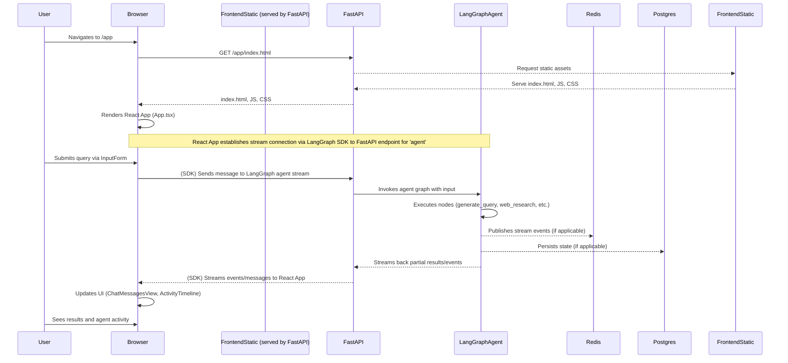
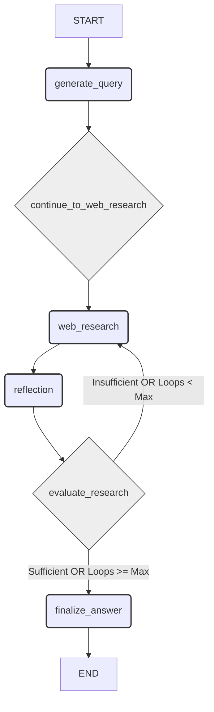
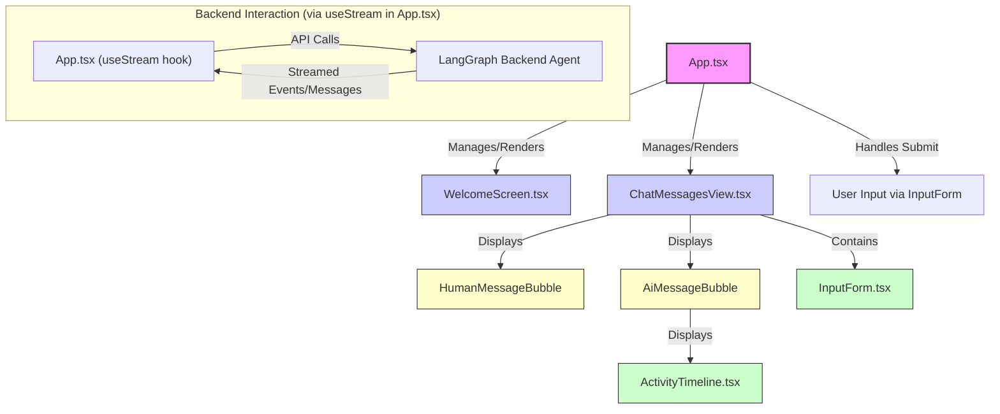
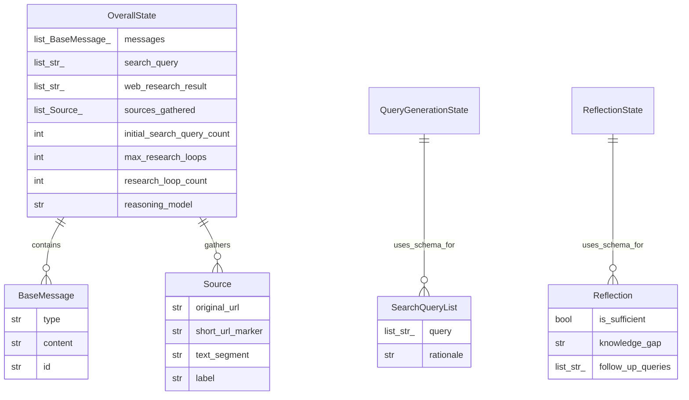

# Comprehensive Technical Analysis of Gemini Fullstack LangGraph Quickstart

This report provides an exhaustive technical analysis of the "Gemini Fullstack LangGraph Quickstart" codebase. The primary finding is that this project serves as a well-structured, moderately complex demonstration of a full-stack AI-powered research agent, leveraging Google's Gemini models via LangGraph on the backend and a React-based interface on the frontend. For potential forkers, the project offers a solid foundation due to its modular backend agent design and standard frontend practices. Key challenges for forkers would include the learning curve associated with LangGraph, managing API key security rigorously, and potentially adapting the agent's logic if a different LLM provider or significantly altered research flow is desired. The build system (Docker, Makefiles) is robust, aiding in reproducibility, but requires familiarity. Overall, it's a valuable asset for understanding how to build and deploy such applications, with clear separation of concerns between the AI backend and the user interface.

[toc]

## 1. Introduction and Overview

This section introduces the Gemini Fullstack LangGraph Quickstart project, outlines the purpose of its original design, details the scope of this analysis, and provides an overview of the primary technologies and architectural style employed. The goal is to set the stage for a deeper dive into the codebase's various components and characteristics, particularly from the perspective of a developer, architect, or team considering its adoption, maintenance, or modification.

### 1.1. Purpose of the Codebase and Original Design Goals

The Gemini Fullstack LangGraph Quickstart project, as inferred from its structure and the `README.md`[^README_loc], is designed to serve as a demonstration and starting point for building full-stack applications featuring an advanced AI agent for research tasks. The core purpose appears to be showcasing the integration of a LangGraph-powered backend agent with a React frontend. The agent's design focuses on performing comprehensive research by dynamically generating search queries, utilizing web search (via Google Search and Gemini models), reflecting on the gathered information to identify knowledge gaps, and iteratively refining its search process until it can synthesize a well-supported answer complete with citations.

[^README_loc]: See file: `README.md`

The original design goals likely included illustrating best practices for structuring such an application, including clear separation between the frontend and backend concerns. Furthermore, a key goal was to demonstrate the capabilities of LangGraph in orchestrating complex, multi-step AI workflows involving interaction with large language models (LLMs) like Google's Gemini for tasks such as query generation, information synthesis, and reflection. The inclusion of Docker configuration suggests a design goal of providing a reproducible and deployable solution. The project aims to provide developers with a concrete example of how to build research-augmented conversational AI, emphasizing dynamic query generation, iterative refinement, and citation of sources, which are crucial for building trust and verifiability in AI-generated content.

### 1.2. Scope of Analysis and Methodology

The scope of this technical analysis encompasses the entirety of the provided "Gemini Fullstack LangGraph Quickstart" codebase. This includes the backend Python application, built with LangGraph and FastAPI, and the frontend React application, built with TypeScript and Vite. The analysis covers architectural design, codebase organization, build systems, deployment considerations, core module functionalities, data management (primarily agent state and API communication), cross-cutting concerns such as configuration and error handling, and an assessment of code quality, maintainability, and extensibility. A significant focus is placed on aspects relevant to a developer or team considering forking the project for their own purposes, including ease of modification, dependency management, and potential refactoring challenges.

The methodology employed for this analysis involved several iterative passes:
1.  **Initial Context Familiarization:** Reviewing the `README.md`[^README_loc], directory structure, and top-level configuration files (`Dockerfile`[^Dockerfile_loc], `docker-compose.yml`[^docker_compose_loc], `Makefile`[^Makefile_loc]) to gain a high-level understanding of the project's purpose, technology stack, and build/deployment mechanisms.
2.  **Architectural Deep Dive:** Analyzing the overall application architecture, identifying key components (frontend, backend API, LangGraph agent), and mapping their primary interactions. This involved examining entry point files for both frontend (`frontend/src/main.tsx`[^frontend_main_tsx_loc]) and backend (`backend/src/agent/app.py`[^backend_app_py_loc], `backend/src/agent/graph.py`[^backend_graph_py_loc]).
3.  **Module-Specific Analysis:** Conducting detailed reviews of individual modules and significant files within both the backend (e.g., agent nodes, state management, prompt definitions) and frontend (e.g., core React components, API interaction logic).
4.  **Cross-Cutting Concerns Review:** Investigating system-wide aspects such as configuration management, error handling, logging (or lack thereof), and security considerations.
5.  **Forkability and Maintainability Assessment:** Evaluating the codebase from the perspective of a developer who might want to extend, modify, or maintain it, focusing on code clarity, modularity, testability, and potential technical debt.

[^Dockerfile_loc]: See file: `Dockerfile`
[^docker_compose_loc]: See file: `docker-compose.yml`
[^Makefile_loc]: See file: `Makefile`
[^frontend_main_tsx_loc]: See file: `frontend/src/main.tsx`
[^backend_app_py_loc]: See file: `backend/src/agent/app.py`
[^backend_graph_py_loc]: See file: `backend/src/agent/graph.py`

Throughout this process, attention was paid to generating relevant Mermaid.js diagrams to visualize structures and flows, and to identify illustrative code snippets. The analysis is based solely on the provided codebase context.

### 1.3. Primary Technologies, Frameworks, and Key Dependencies (including licenses if discernible)

The Gemini Fullstack LangGraph Quickstart project leverages a modern technology stack, clearly bifurcated between its backend and frontend components. On the **backend**, the primary language is Python. The core AI agent logic is built using **LangGraph**[^backend_pyproject_toml_loc], a library for constructing stateful, multi-actor applications with LLMs. The LangGraph agent itself utilizes **Google Gemini** models (e.g., Gemini 2.0 Flash, 2.5 Flash, 2.5 Pro as specified in `backend/src/agent/configuration.py`[^backend_config_py_loc]) for tasks like query generation, web searching (via Google Search tool integration within Gemini), reflection, and answer synthesis. The web framework exposing the agent as an API is **FastAPI**[^backend_pyproject_toml_loc], known for its high performance and ease of use. Dependency management for Python is handled by `pip` with `uv` as a fast installer/resolver, as indicated by `backend/Makefile`[^backend_Makefile_loc] and `backend/pyproject.toml`[^backend_pyproject_toml_loc]. Key Python dependencies include `langgraph`, `langchain-google-genai`, `fastapi`, and `python-dotenv`. The project itself is licensed under Apache License 2.0, as stated in the root `LICENSE` file and `README.md`[^README_loc]. Many Python dependencies typically use permissive licenses like MIT or Apache 2.0.

[^backend_pyproject_toml_loc]: See file: `backend/pyproject.toml`
[^backend_config_py_loc]: See file: `backend/src/agent/configuration.py`
[^backend_Makefile_loc]: See file: `backend/Makefile`

On the **frontend**, the application is a single-page application (SPA) built with **React**[^frontend_package_json_loc] and **TypeScript**[^frontend_tsconfig_json_loc] for type safety. The build tool and development server is **Vite**[^frontend_vite_config_ts_loc], known for its speed. Styling is managed by **Tailwind CSS**[^frontend_package_json_loc], a utility-first CSS framework, and components from **Shadcn UI**[^frontend_components_json_loc] are utilized, which provides accessible and reusable UI components. State management and interaction with the backend API appear to leverage `@langchain/langgraph-sdk/react`, specifically the `useStream` hook as seen in `frontend/src/App.tsx`[^frontend_App_tsx_loc]. Node.js and npm are used for managing frontend dependencies and running development scripts. Key frontend dependencies include `react`, `react-dom`, `@langchain/langgraph-sdk`, `tailwindcss`, and `lucide-react` for icons. Frontend dependencies are typically under permissive licenses like MIT. For production deployment, as detailed in `docker-compose.yml`[^docker_compose_loc], the backend relies on **Redis** for pub-sub messaging (enabling real-time streaming) and **PostgreSQL** for persisting assistant/thread states and managing background tasks, which are common requirements for robust LangGraph deployments.

[^frontend_package_json_loc]: See file: `frontend/package.json`
[^frontend_tsconfig_json_loc]: See file: `frontend/tsconfig.json`
[^frontend_vite_config_ts_loc]: See file: `frontend/vite.config.ts`
[^frontend_components_json_loc]: See file: `frontend/components.json`
[^frontend_App_tsx_loc]: See file: `frontend/src/App.tsx`

### 1.4. High-Level Architectural Style

The application follows a classic **Client-Server architectural style**, with a clear separation of concerns between the presentation layer (frontend) and the business logic/AI processing layer (backend). The backend itself can be described as an **Agent-based architecture** orchestrated by LangGraph. It exposes its services via a RESTful API (implicitly, through FastAPI and the LangGraph SDK).

```mermaid
graph TD
    User[End User] -->|Interacts via Browser| FE[React Frontend];
    FE -->|HTTP API Calls (Streaming via SDK)| BE_API[FastAPI Server];

    subgraph Backend System
        BE_API -->|Delegates to| LG_Agent[LangGraph Research Agent];
        LG_Agent -->|Uses| Gemini[Google Gemini LLMs];
        LG_Agent -->|Uses| GSearch[Google Search Tool];
        Gemini -->|Provides Models| LG_Agent;
        GSearch -->|Provides Search Results| LG_Agent;

        subgraph "Production Dependencies (LangGraph)"
            LG_Agent -.->|Pub/Sub for Streaming| Redis[Redis];
            LG_Agent -.->|State Persistence, Task Queue| Postgres[PostgreSQL];
        end
    end

    style FE fill:#f9f,stroke:#333,stroke-width:2px;
    style BE_API fill:#ccf,stroke:#333,stroke-width:2px;
    style LG_Agent fill:#9cf,stroke:#333,stroke-width:2px;
    style Gemini fill:#ff9,stroke:#333,stroke-width:2px;
    style GSearch fill:#ff9,stroke:#333,stroke-width:2px;
    style Redis fill:#fcc,stroke:#333,stroke-width:2px;
    style Postgres fill:#fcc,stroke:#333,stroke-width:2px;
```

The diagram above illustrates this high-level architecture. The 'End User' interacts with the 'React Frontend' (FE). The frontend communicates with the 'FastAPI Server' (BE_API) using HTTP API calls, specifically leveraging the LangGraph SDK for streaming responses. The FastAPI server, in turn, delegates the core processing to the 'LangGraph Research Agent' (LG_Agent). This agent orchestrates interactions with 'Google Gemini LLMs' for various reasoning tasks and the 'Google Search Tool' for information retrieval. In a production environment, the LangGraph agent would also interact with 'Redis' for message queuing (supporting streaming output) and 'PostgreSQL' for persistent storage of state and task management, as indicated by the `docker-compose.yml`[^docker_compose_loc]. For a potential forker, this separation is beneficial. The frontend can be independently developed or even replaced as long as it adheres to the API contract. Similarly, the backend agent's internal logic can be modified or extended without directly impacting the frontend, provided the API interface remains compatible. The reliance on external services like Gemini and Google Search, along with production dependencies like Redis and Postgres, are important considerations for deployment and operational management.

## 2. Codebase Organization, Build System, and Deployment Considerations

This section delves into the physical layout of the codebase, the mechanisms used for building and packaging the application, and considerations related to its deployment. Understanding these aspects is crucial for developers aiming to work with, extend, or deploy the system.

### 2.1. Directory Layout and Module Organization

The project's root directory presents a clean and standard organization for a full-stack application, clearly separating frontend and backend concerns. Key top-level directories and files include:
*   `backend/`: Contains all Python code related to the LangGraph agent and the FastAPI server.
*   `frontend/`: Contains all TypeScript and React code for the user interface.
*   `Dockerfile`[^Dockerfile_loc]: Defines the multi-stage Docker build process for creating a production image.
*   `docker-compose.yml`[^docker_compose_loc]: Orchestrates the deployment of the application along with its dependencies (Redis, Postgres) in a Docker environment.
*   `Makefile`[^Makefile_loc]: Provides convenient make targets for common development tasks like starting dev servers.
*   `README.md`[^README_loc]: Offers project overview, setup, and usage instructions.
*   `LICENSE`[^LICENSE_loc]: Contains the Apache 2.0 license for the project.

[^LICENSE_loc]: See file: `LICENSE`

Within the `backend/` directory, the structure is as follows:
*   `src/agent/`: This is the core module containing the agent's logic.
    *   `app.py`[^backend_app_py_loc]: FastAPI application setup, primarily mounting the LangGraph agent and serving the frontend static files in production.
    *   `graph.py`[^backend_graph_py_loc]: Defines the LangGraph state graph, including nodes (agent steps) and edges (transitions). This is the heart of the AI agent.
    *   `prompts.py`[^backend_prompts_py_loc]: Contains the prompt templates used by the LLM for various tasks (query generation, reflection, answer synthesis).
    *   `state.py`[^backend_state_py_loc]: Defines the Pydantic models and TypedDicts representing the agent's state as it progresses through the graph.
    *   `tools_and_schemas.py`[^backend_tools_schemas_py_loc]: Defines Pydantic schemas for structured output from LLMs (e.g., search queries, reflection results).
    *   `configuration.py`[^backend_config_py_loc]: Manages agent configuration parameters like model names and loop counts.
    *   `utils.py`[^backend_utils_py_loc]: Contains utility functions used by the agent, such as URL resolution and citation processing.
*   `examples/`: Contains example scripts, like `cli_research.py`[^backend_cli_research_py_loc], for running the agent from the command line.
*   `Makefile`[^backend_Makefile_loc]: Specific make targets for backend development (linting, testing).
*   `pyproject.toml`[^backend_pyproject_toml_loc]: Defines project metadata and Python dependencies.
*   `.env.example`: Template for environment variables (e.g., `GEMINI_API_KEY`).

[^backend_prompts_py_loc]: See file: `backend/src/agent/prompts.py`
[^backend_state_py_loc]: See file: `backend/src/agent/state.py`
[^backend_tools_schemas_py_loc]: See file: `backend/src/agent/tools_and_schemas.py`
[^backend_utils_py_loc]: See file: `backend/src/agent/utils.py`
[^backend_cli_research_py_loc]: See file: `backend/examples/cli_research.py`

The `frontend/` directory follows a typical React project structure:
*   `src/`: Contains the source code for the React application.
    *   `App.tsx`[^frontend_App_tsx_loc]: The main application component, managing state and orchestrating UI views.
    *   `main.tsx`[^frontend_main_tsx_loc]: The entry point for the React application, rendering the root component.
    *   `components/`: Contains reusable React components.
        *   `ui/`: Likely contains Shadcn UI components or custom UI primitives.
        *   `ActivityTimeline.tsx`[^frontend_ActivityTimeline_tsx_loc]: Displays the agent's activity steps.
        *   `ChatMessagesView.tsx`[^frontend_ChatMessagesView_tsx_loc]: Renders the chat interface.
        *   `InputForm.tsx`[^frontend_InputForm_tsx_loc]: Handles user input for queries.
        *   `WelcomeScreen.tsx`[^frontend_WelcomeScreen_tsx_loc]: The initial screen presented to the user.
    *   `lib/`: Contains utility functions, e.g., `utils.ts`[^frontend_utils_ts_loc].
*   `public/`: Static assets served directly by the development server or copied to the build output.
*   `package.json`[^frontend_package_json_loc]: Defines project metadata, scripts (dev, build), and frontend dependencies.
*   `vite.config.ts`[^frontend_vite_config_ts_loc]: Configuration for the Vite build tool and development server.
*   `tsconfig.json`[^frontend_tsconfig_json_loc]: TypeScript compiler options.

[^frontend_ActivityTimeline_tsx_loc]: See file: `frontend/src/components/ActivityTimeline.tsx`
[^frontend_ChatMessagesView_tsx_loc]: See file: `frontend/src/components/ChatMessagesView.tsx`
[^frontend_InputForm_tsx_loc]: See file: `frontend/src/components/InputForm.tsx`
[^frontend_WelcomeScreen_tsx_loc]: See file: `frontend/src/components/WelcomeScreen.tsx`
[^frontend_utils_ts_loc]: See file: `frontend/src/lib/utils.ts`

This organization is logical and promotes separation of concerns, making it easier for developers to locate relevant code. For a forker, understanding the distinct roles of `backend/src/agent` and `frontend/src` is paramount.

### 2.2. Build System, Compilation, and Packaging

The project employs a multi-faceted build system leveraging Makefiles, Docker, npm (for frontend), and Python packaging tools (pip/uv with setuptools for backend). The root `Makefile`[^Makefile_loc] orchestrates development environment startup, with targets like `make dev` which concurrently starts the frontend and backend development servers.

The frontend build process is managed by Vite, as defined in `frontend/vite.config.ts`[^frontend_vite_config_ts_loc] and invoked via npm scripts in `frontend/package.json`[^frontend_package_json_loc] (e.g., `npm run build`). This compiles the TypeScript/React code into optimized static JavaScript, HTML, and CSS assets, typically placed in `frontend/dist/`. This `dist` directory is then served by the backend FastAPI application in a production scenario, as configured in `backend/src/agent/app.py`[^backend_app_py_loc].

The backend Python code does not require a separate "compilation" step in the traditional sense but is packaged as an installable Python package using `setuptools`, as defined in `backend/pyproject.toml`[^backend_pyproject_toml_loc]. Dependencies are installed using `pip install .` (often via `uv` for speed) in the `backend` directory.

Production packaging is handled by the `Dockerfile`[^Dockerfile_loc]. It's a multi-stage build:
1.  **Stage 1 (`frontend-builder`):** Uses a Node.js image to install frontend dependencies (`npm install`) and build the static frontend assets (`npm run build`). These assets are then copied to a later stage.
2.  **Stage 2 (Python Backend):** Starts from a `langchain/langgraph-api:3.11` base image. It installs `uv`, copies the built frontend assets from Stage 1 into `/deps/frontend/dist`, adds the local backend code from `backend/` to `/deps/backend/`, and then uses `uv pip install` to install the backend package and its dependencies. Environment variables `LANGGRAPH_HTTP` and `LANGSERVE_GRAPHS` are set to point LangGraph to the FastAPI app and the agent graph definition respectively.

A forker wishing to customize the build would need to understand these different layers. For example:
*   Modifying frontend dependencies: Edit `frontend/package.json` and potentially `frontend/vite.config.ts`.
*   Modifying backend dependencies: Edit `backend/pyproject.toml`.
*   Changing build logic for Docker: Modify `Dockerfile`[^Dockerfile_loc]. For instance, if different base images are needed or additional system packages are required.
*   Altering development workflows: Adjust targets in the respective `Makefile`s.

The system is reasonably flexible. The use of `uv` in the `Dockerfile` and `backend/Makefile`[^backend_Makefile_loc] is a modern touch for faster Python dependency management. The multi-stage Docker build is efficient as it keeps the final image cleaner by not including frontend build tools.

### 2.3. Key External Dependencies and Their Management

External dependencies are managed separately for the backend and frontend.

**Backend Dependencies:**
Managed via `backend/pyproject.toml`[^backend_pyproject_toml_loc] and installed using `pip` (typically with `uv`). Key dependencies include:
*   `langgraph`: The core framework for building the agent. Version `^0.2.6` is specified.
*   `langchain`: Provides foundational components for LLM interactions. Version `^0.3.19`.
*   `langchain-google-genai`: Specific integration for Google Gemini models.
*   `fastapi`: The web framework for the API.
*   `google-genai`: The Python SDK for Google Gemini.
*   `python-dotenv`: For loading environment variables from a `.env` file.
*   `langgraph-sdk`, `langgraph-cli`, `langgraph-api`: Components related to the LangGraph ecosystem for development, CLI interaction, and API serving.

For a forker, updating these dependencies would involve modifying `backend/pyproject.toml` and re-running `pip install .` (or the equivalent `uv` command). Potential challenges could arise from breaking changes in major versions of LangGraph or LangChain, requiring code adaptations. Replacing `langchain-google-genai` with another provider (e.g., OpenAI) would be a significant change, impacting model invocation, prompt formatting, and potentially tool usage within the agent.

**Frontend Dependencies:**
Managed via `frontend/package.json`[^frontend_package_json_loc] and installed using `npm install`. Key dependencies include:
*   `@langchain/langgraph-sdk`: Provides the `useStream` hook for interacting with the LangGraph backend. Version `^0.0.74`.
*   `react`, `react-dom`: Core React libraries. Version `^19.0.0`.
*   `@vitejs/plugin-react-swc`: Vite plugin for React.
*   `tailwindcss`: Utility CSS framework. Version `^4.1.5`.
*   `lucide-react`: Icon library.
*   Shadcn UI related packages (`@radix-ui/*`, `class-variance-authority`, `clsx`, `tailwind-merge`).

Forkers updating frontend dependencies would edit `frontend/package.json` and run `npm install`. Major React version changes could require significant refactoring. Swapping out Tailwind CSS or Shadcn UI would be a substantial UI overhaul. The `@langchain/langgraph-sdk` is critical for the current communication pattern; replacing it or its usage would necessitate a rewrite of the data fetching and state management logic in `frontend/src/App.tsx`[^frontend_App_tsx_loc].

**Deployment Dependencies (Production):**
As specified in `docker-compose.yml`[^docker_compose_loc]:
*   `redis:6`: Used by LangGraph for its message broker capabilities, essential for streaming.
*   `postgres:16`: Used by LangGraph for persistence (e.g., thread state, run history).

A forker choosing a different persistence or messaging backend for LangGraph (if supported and configurable) would need to update `docker-compose.yml` and potentially backend configurations related to LangGraph. The current setup assumes these services are available to the `langgraph-api` container.

The versions specified are relatively recent at the time of this analysis, which is good for accessing new features but also means being mindful of the evolving nature of AI frameworks like LangGraph.

### 2.4. Main Entry Points and Execution Flow

Understanding the main entry points is key to grasping how the application starts and operates.

**Backend Execution:**
For development, the backend is typically started using `make dev-backend` from the root directory, which translates to `cd backend && langgraph dev` as per `Makefile`[^Makefile_loc]. The `langgraph dev` command likely uses the information in `backend/pyproject.toml` along with environment variables like `LANGGRAPH_HTTP` and `LANGSERVE_GRAPHS` (seen in `Dockerfile`[^Dockerfile_loc]) to locate and serve the FastAPI application (`backend/src/agent/app.py`[^backend_app_py_loc]) and the defined LangGraph graph (`backend/src/agent/graph.py`[^backend_graph_py_loc]). The FastAPI app, once started, listens for HTTP requests on a configured port (e.g., `http://127.0.0.1:2024` during development).

The `backend/src/agent/app.py`[^backend_app_py_loc] itself is quite minimal. Its primary role, beyond what the LangGraph SDK provides for exposing the agent, is to serve the static frontend files in a production build.
```python
# backend/src/agent/app.py
# mypy: disable - error - code = "no-untyped-def,misc"
import pathlib
from fastapi import FastAPI, Response
from fastapi.staticfiles import StaticFiles

# Define the FastAPI app
app = FastAPI()

# ... (create_frontend_router function) ...

# Mount the frontend under /app to not conflict with the LangGraph API routes
app.mount(
    "/app",
    create_frontend_router(),
    name="frontend",
)
```
[^backend_app_py_loc_snippet]: Snippet from: `backend/src/agent/app.py`

The actual AI logic execution begins when an API call reaches an endpoint managed by the LangGraph agent defined in `backend/src/agent/graph.py`[^backend_graph_py_loc]. This file constructs a `StateGraph` and defines various nodes representing stages of the research process.

**Frontend Execution:**
For development, the frontend is started using `make dev-frontend` from the root, which translates to `cd frontend && npm run dev` (`Makefile`[^Makefile_loc], `frontend/package.json`[^frontend_package_json_loc]). This command invokes Vite, which compiles the application and starts a development server (e.g., `http://localhost:5173`).
The browser loads `frontend/index.html`, which then bootstraps the React application via `frontend/src/main.tsx`[^frontend_main_tsx_loc].
```typescript
// frontend/src/main.tsx
import React from "react";
import ReactDOM from "react-dom/client";
import App from "./App.tsx";
import "./global.css";

ReactDOM.createRoot(document.getElementById("root")!).render(
  <React.StrictMode>
    <App />
  </React.StrictMode>
);
```
[^frontend_main_tsx_snippet]: Snippet from: `frontend/src/main.tsx`
This renders the main `App` component (`frontend/src/App.tsx`[^frontend_App_tsx_loc]), which sets up the UI and the connection to the backend using the `useStream` hook.

**Application Startup Sequence (Conceptual for Production Docker):**
The following Mermaid sequence diagram illustrates a simplified startup and interaction flow in a production Docker environment.



This diagram shows the user accessing the frontend, which is served by the FastAPI backend. When the user submits a query, the frontend (via the LangGraph SDK) sends this to the LangGraph agent running within FastAPI. The agent processes the query, potentially interacting with Redis and Postgres for its operational needs (streaming, persistence), and streams results back to the frontend, which then updates the UI. This flow highlights the interplay between the components and the importance of the LangGraph SDK in facilitating the streaming communication. For a forker, understanding this sequence is vital for debugging or modifying the interaction patterns.

## 3. Core Modules and Components Analysis

This section provides a detailed analysis of the core modules and components within both the backend and frontend. The backend's heart is the LangGraph agent, while the frontend's core revolves around the `App.tsx` component and its sub-components that manage user interaction and data display.

### 3.1. Backend: LangGraph Agent (`backend/src/agent/`)

The entire `backend/src/agent/` directory constitutes the core of the AI research agent. Its primary responsibility is to take a user's query, perform iterative web research using Google Gemini and Google Search, and synthesize a final answer with citations.

#### 3.1.1. Purpose and Responsibilities of the Agent Graph (`graph.py`)

The file `backend/src/agent/graph.py`[^backend_graph_py_loc] defines the central LangGraph `StateGraph`. This graph orchestrates the agent's behavior through a series of nodes and conditional edges. Its main responsibilities are:
1.  **Query Generation:** Taking the initial user message and generating a set of appropriate search queries using an LLM.
2.  **Web Research:** Executing each search query using Google Search (via Gemini's tool use) and gathering content.
3.  **Reflection:** Analyzing the gathered search results to identify if the information is sufficient or if there are knowledge gaps.
4.  **Iterative Refinement:** If gaps are identified and the maximum loop count isn't reached, generate follow-up queries and repeat the web research and reflection steps.
5.  **Answer Finalization:** Once research is deemed sufficient or iterations are maxed out, synthesize a coherent answer from all gathered information, including citations.

The graph manages the overall state (`OverallState` from `state.py`[^backend_state_py_loc]) of the research process, passing relevant parts of the state to each node and updating it based on the node's output.

#### 3.1.2. Key Classes, Functions, and Interfaces in the Agent

*   **State Definitions (`state.py`[^backend_state_py_loc]):**
    *   `OverallState(TypedDict)`: The main state object for the graph. It includes `messages` (conversation history), `search_query` (list of queries), `web_research_result` (list of summaries from web searches), `sources_gathered`, and control parameters like `initial_search_query_count`, `max_research_loops`, `research_loop_count`, and `reasoning_model`.
    *   Other `TypedDict`s like `ReflectionState`, `QueryGenerationState`, `WebSearchState` define the expected structure of data passed to or returned by specific nodes or parts of the state.
    ```python
    # backend/src/agent/state.py
    class OverallState(TypedDict):
        messages: Annotated[list, add_messages]
        search_query: Annotated[list, operator.add]
        web_research_result: Annotated[list, operator.add]
        sources_gathered: Annotated[list, operator.add]
        initial_search_query_count: int
        max_research_loops: int
        research_loop_count: int
        reasoning_model: str
    ```
    [^backend_state_py_OverallState_snippet]: Snippet from: `backend/src/agent/state.py`, class `OverallState`.
    These state objects are crucial interfaces between the graph nodes.

*   **Configuration (`configuration.py`[^backend_config_py_loc]):**
    *   `Configuration(BaseModel)`: A Pydantic model defining configurable parameters for the agent, such as `query_generator_model`, `reflection_model`, `answer_model`, `number_of_initial_queries`, and `max_research_loops`. It includes a class method `from_runnable_config` to load values from environment variables or a `RunnableConfig` object. This allows for flexible configuration at runtime.
    ```python
    # backend/src/agent/configuration.py
    class Configuration(BaseModel):
        query_generator_model: str = Field(default="gemini-2.0-flash", ...)
        reflection_model: str = Field(default="gemini-2.5-flash", ...)
        answer_model: str = Field(default="gemini-2.5-pro", ...)
        number_of_initial_queries: int = Field(default=3, ...)
        max_research_loops: int = Field(default=2, ...)
    ```
    [^backend_config_py_Configuration_snippet]: Snippet from: `backend/src/agent/configuration.py`, class `Configuration`.

*   **Schemas for LLM Output (`tools_and_schemas.py`[^backend_tools_schemas_py_loc]):**
    *   `SearchQueryList(BaseModel)`: Pydantic model for the output of the query generation LLM call. Expects a `query` (list of strings) and a `rationale` (string).
    *   `Reflection(BaseModel)`: Pydantic model for the output of the reflection LLM call. Expects `is_sufficient` (boolean), `knowledge_gap` (string), and `follow_up_queries` (list of strings).
    Using these Pydantic models with `llm.with_structured_output()` ensures that the LLM's responses are parsed into a predictable Python object structure, which is vital for reliable agent operation.

*   **Graph Nodes in `graph.py`[^backend_graph_py_loc]:**
    *   `generate_query(state: OverallState, config: RunnableConfig) -> QueryGenerationState`: Generates initial search queries.
    *   `continue_to_web_research(state: QueryGenerationState)`: A conditional edge function that prepares inputs for parallel web research tasks.
    *   `web_research(state: WebSearchState, config: RunnableConfig) -> OverallState`: Performs web search for a single query using Gemini's Google Search tool.
    *   `reflection(state: OverallState, config: RunnableConfig) -> ReflectionState`: Analyzes search results and decides if more research is needed.
    *   `evaluate_research(state: ReflectionState, config: RunnableConfig) -> OverallState`: Conditional edge function that routes to either more web research or finalizes the answer.
    *   `finalize_answer(state: OverallState, config: RunnableConfig)`: Generates the final answer using all gathered information.

*   **Prompt Definitions (`prompts.py`[^backend_prompts_py_loc]):**
    This file contains string templates for the various prompts used by the LLMs at different stages (e.g., `query_writer_instructions`, `web_searcher_instructions`, `reflection_instructions`, `answer_instructions`). These prompts guide the LLMs to perform their specific sub-tasks. They include placeholders for dynamic information like `{current_date}`, `{research_topic}`, and `{summaries}`.

*   **Utility Functions (`utils.py`[^backend_utils_py_loc]):**
    Contains helper functions like `get_current_date()`, `get_research_topic()`, `insert_citation_markers()`, and `resolve_urls()`. `resolve_urls` is particularly interesting as it mentions resolving URLs to "short urls for saving tokens and time," which implies an optimization strategy.

The interplay between these components defines the agent's functionality. For instance, `generate_query` uses `query_writer_instructions` and expects output matching `SearchQueryList`.

#### 3.1.3. Internal Logic and Key Algorithms of the Agent Graph

The core logic resides in the state transitions and node operations defined in `graph.py`[^backend_graph_py_loc].



The diagram above provides a flowchart representation of the agent's main operational loop.
1.  **Start & Query Generation (`generate_query`):** The process begins, and initial search queries are generated based on the user's input message. The number of initial queries can be configured.
2.  **Parallel Web Research (`web_research`):** The `continue_to_web_research` node likely uses LangGraph's capability to spawn multiple parallel executions of the `web_research` node, one for each generated query. Each `web_research` node uses Gemini with its Google Search tool to fetch information for its assigned query. It processes the results, extracts citations, and creates a summary.
3.  **Reflection (`reflection`):** After all (or a batch of) web research tasks complete, their outputs (summaries and sources) are aggregated. The `reflection` node then uses an LLM to analyze these summaries against the original research topic. It determines if the current information is sufficient or if there are knowledge gaps, and if necessary, generates `follow_up_queries`.
4.  **Evaluation & Iteration (`evaluate_research`):** This conditional node checks the `is_sufficient` flag from the reflection step and the `research_loop_count`. If the information is not sufficient and the loop count is below `max_research_loops` (configurable, default 2 in `configuration.py`[^backend_config_py_loc]), it routes the flow back to `web_research` with the new `follow_up_queries`. The `id` for these new searches is incremented to distinguish them.
5.  **Answer Finalization (`finalize_answer`):** If the information is deemed sufficient or the maximum loops are reached, the flow proceeds to `finalize_answer`. This node takes all the `web_research_result` summaries and the original `research_topic` to generate a consolidated, well-structured final answer using an LLM. It also ensures that short URLs used internally are replaced with original URLs in the final output and that all used sources are correctly cited.
6.  **End:** The process concludes, and the final answer is part of the agent's state, ready to be streamed/sent to the client.

A key algorithmic aspect is the iterative refinement loop (Web Research -> Reflection -> Evaluate). The quality of this loop heavily depends on the LLM's ability to perform effective reflection and generate insightful follow-up queries. The use of structured output schemas (`SearchQueryList`, `Reflection`) is critical for making these LLM interactions reliable.

#### 3.1.4. Interactions and Dependencies (Internal and External)

**Internal Interactions:**
*   Nodes in `graph.py`[^backend_graph_py_loc] interact by modifying and reading from the shared `OverallState`.
*   Nodes depend on `prompts.py`[^backend_prompts_py_loc] for LLM instructions.
*   Nodes use schemas from `tools_and_schemas.py`[^backend_tools_schemas_py_loc] for LLM communication.
*   Nodes use configuration from `configuration.py`[^backend_config_py_loc].
*   Nodes use helper functions from `utils.py`[^backend_utils_py_loc].
*   The `app.py`[^backend_app_py_loc] module makes the graph accessible via an API (through LangGraph's machinery).

**External Dependencies/Interactions:**
*   **Google Gemini LLMs:** All core reasoning (query generation, reflection, answer synthesis) and tool use orchestration (Google Search) are performed by making calls to various Gemini models (Flash/Pro versions). This is primarily done via the `langchain-google-genai` library. The `GEMINI_API_KEY` environment variable is essential.
*   **Google Search:** Used indirectly via the Gemini model's tool-use capability within the `web_research` node.
*   **LangSmith (Optional but Recommended):** The `docker-compose.yml`[^docker_compose_loc] includes `LANGSMITH_API_KEY`, suggesting integration with LangSmith for tracing and debugging LangGraph executions. This is an external service.
*   **Redis & PostgreSQL (Production):** As discussed, these are external services required for robust LangGraph operation in production (streaming, persistence).

A forker needs to manage the `GEMINI_API_KEY` and potentially `LANGSMITH_API_KEY`. If deploying to production, setting up and managing Redis and PostgreSQL instances is necessary. Any instability or changes in the Gemini API or Google Search functionality could directly impact the agent's performance.

#### 3.1.5. Configuration and Extensibility Points within the Agent

The agent offers several points for configuration and extension:

*   **Model Selection:** `configuration.py`[^backend_config_py_loc] allows specifying different Gemini models for query generation, reflection, and final answer synthesis (e.g., `query_generator_model`, `reflection_model`, `answer_model`). Forkers can experiment with different models or newer versions by changing these defaults or setting corresponding environment variables.
*   **Research Depth/Breadth:**
    *   `number_of_initial_queries`: Controls how many parallel searches are kicked off initially.
    *   `max_research_loops`: Controls the maximum number of reflection/refinement iterations.
    These are also configurable via `configuration.py`[^backend_config_py_loc] or environment variables and can be adjusted by the frontend per request (as seen in `App.tsx`'s `handleSubmit`[^frontend_App_tsx_loc]).
*   **Prompts:** The prompts in `prompts.py`[^backend_prompts_py_loc] can be directly modified to change the agent's behavior, tone, or focus. This is a powerful extension point. For example, one could add more constraints or ask for output in a different style.
*   **Adding New Tools/Steps:** LangGraph's design facilitates adding new nodes (steps) or tools to the graph. A forker could introduce a new tool (e.g., a calculator, a database lookup) by:
    1.  Defining a Pydantic schema for its input/output (in `tools_and_schemas.py`[^backend_tools_schemas_py_loc]).
    2.  Creating a new function (node) in `graph.py`[^backend_graph_py_loc] that uses this tool.
    3.  Integrating this new node into the graph flow with appropriate edges.
*   **Modifying Existing Node Logic:** The Python functions for each node in `graph.py`[^backend_graph_py_loc] can be altered. For example, the criteria for `is_sufficient` in the `reflection` node could be made more sophisticated.
*   **Structured Output Schemas:** If the desired output from an LLM changes (e.g., the reflection needs to produce an additional piece of information), the corresponding Pydantic model in `tools_and_schemas.py`[^backend_tools_schemas_py_loc] can be updated, and the prompt adjusted accordingly.

The primary challenge for extensibility lies in understanding the LangGraph state model and ensuring that any new components correctly interact with the existing state and graph structure.

#### 3.1.6. Testability and Existing Test Coverage for the Agent

The `backend/Makefile`[^backend_Makefile_loc] includes targets for testing:
```makefile
# backend/Makefile
TEST_FILE ?= tests/unit_tests/

test:
	uv run --with-editable . pytest $(TEST_FILE)

test_watch:
	uv run --with-editable . ptw --snapshot-update --now . -- -vv tests/unit_tests/
```
[^backend_Makefile_test_snippet]: Snippet from: `backend/Makefile`

This indicates that `pytest` is the chosen testing framework and that tests are expected to be in a `tests/unit_tests/` directory. However, upon inspecting the provided file listing, a dedicated `tests/unit_tests/` directory directly under `backend/` or `backend/src/agent/` is not immediately apparent. There is a `backend/test-agent.ipynb`[^backend_test_agent_ipynb_loc] which is a Jupyter notebook. This notebook likely serves as an interactive way to test the agent's functionality, perhaps for integration or end-to-end testing scenarios. The `backend/examples/cli_research.py`[^backend_cli_research_py_loc] script also allows for command-line execution and can be used for manual testing or simple integration checks.

[^backend_test_agent_ipynb_loc]: See file: `backend/test-agent.ipynb`

The `Makefile` also refers to `pytest --only-extended $(TEST_FILE)`, suggesting a mechanism for running more comprehensive or time-consuming tests. The actual test files and their content are not visible in the initial file listing provided for this analysis beyond the notebook.

**Assessment of Testability:**
*   **Unit Testing:** Individual nodes in `graph.py`[^backend_graph_py_loc] could be unit-tested if their dependencies (like LLM calls) are mocked. For example, one could test the `reflection` node by providing mock summaries and asserting the generated `Reflection` object. The Pydantic schemas in `tools_and_schemas.py`[^backend_tools_schemas_py_loc] and utility functions in `utils.py`[^backend_utils_py_loc] are also amenable to unit testing.
*   **Integration Testing:** Testing the interaction between nodes or the entire graph flow is more complex. LangGraph itself might offer utilities for this, or it could be done by running the graph with mock LLM responses that simulate a multi-step interaction. The `test-agent.ipynb` might be fulfilling this role.
*   **End-to-End Testing:** Testing from the API endpoint down to the final response would involve spinning up the FastAPI server and making HTTP requests.

**Challenges for Forkers:**
If formal unit tests are sparse (beyond the notebook), a forker planning significant modifications would need to invest in writing a good suite of tests. Mocking LLM calls effectively is key for reliable and fast unit tests of agent components. Testing the conditional logic in `evaluate_research` would require careful setup of different state conditions. The non-deterministic nature of LLMs can make end-to-end testing tricky to automate for exact output, often requiring checks for semantic correctness or the presence of key information instead.

The existing setup with `pytest` and `Makefile` targets provides a foundation, but the depth of actual test coverage is unclear without seeing the contents of the `tests/` directory (if it exists and is populated). The Jupyter notebook is a good tool for exploration and debugging but is not a substitute for an automated test suite.

### 3.2. Frontend: React Application (`frontend/src/`)

The frontend is a React single-page application (SPA) responsible for providing the user interface to interact with the backend research agent. It's built with TypeScript, Vite, and styled with Tailwind CSS, using Shadcn UI components.

#### 3.2.1. Purpose and Responsibilities of `App.tsx`

`frontend/src/App.tsx`[^frontend_App_tsx_loc] is the main component of the frontend application. Its primary responsibilities include:
1.  **Overall Application Layout:** Structuring the main view of the application.
2.  **State Management:** Managing the conversation state, including messages, agent activity events, and any errors. It uses the `useStream` hook from `@langchain/langgraph-sdk/react` to manage the streaming communication with the backend agent.
3.  **Orchestrating UI Components:** Rendering different views based on the application state (e.g., `WelcomeScreen`[^frontend_WelcomeScreen_tsx_loc] if no messages, `ChatMessagesView`[^frontend_ChatMessagesView_tsx_loc] during an active chat, or an error display).
4.  **Handling User Input:** Receiving user queries from `InputForm.tsx`[^frontend_InputForm_tsx_loc] and submitting them to the backend agent via the `useStream` hook's `submit` function.
5.  **Processing and Displaying Agent Activity:** Receiving real-time events from the backend stream (e.g., `generate_query`, `web_research`, `reflection`, `finalize_answer` events) and processing them into a format suitable for the `ActivityTimeline.tsx`[^frontend_ActivityTimeline_tsx_loc] component. It maintains both live activity for the current interaction and historical activity for past messages.

It acts as the central controller for the frontend experience.

#### 3.2.2. Key Components and Their Interactions



The diagram above shows the primary frontend components and their relationships, centered around `App.tsx`.

*   **`App.tsx`[^frontend_App_tsx_loc]:**
    *   Uses `useStream` to connect to the backend. This hook provides `messages`, `isLoading`, `submit`, `stop`, and an `onUpdateEvent` callback.
    *   `onUpdateEvent`: This callback is crucial. It listens for specific event keys from the backend stream (e.g., `event.generate_query`, `event.web_research`) and transforms them into `ProcessedEvent` objects for the `ActivityTimeline`.
        ```typescript
        // frontend/src/App.tsx
        // ...
        onUpdateEvent: (event: any) => {
          let processedEvent: ProcessedEvent | null = null;
          if (event.generate_query) {
            processedEvent = {
              title: "Generating Search Queries",
              data: event.generate_query?.search_query?.join(", ") || "",
            };
          } else if (event.web_research) {
            // ... processes web_research event ...
          } else if (event.reflection) {
            // ... processes reflection event ...
          } else if (event.finalize_answer) {
            // ... processes finalize_answer event ...
            hasFinalizeEventOccurredRef.current = true;
          }
          if (processedEvent) {
            setProcessedEventsTimeline((prevEvents) => [
              ...prevEvents,
              processedEvent!,
            ]);
          }
        },
        // ...
        ```
        [^frontend_App_tsx_onUpdateEvent_snippet]: Snippet from: `frontend/src/App.tsx`, `onUpdateEvent` callback.
    *   Manages `processedEventsTimeline` (for live updates) and `historicalActivities` (to store activity related to specific AI messages).
    *   The `handleSubmit` function is passed down to input components. It takes the user's text, selected effort, and model, then formats them into the structure expected by the backend agent's `useStream` `submit` function, including `initial_search_query_count` and `max_research_loops` derived from the "effort" setting.

*   **`WelcomeScreen.tsx`[^frontend_WelcomeScreen_tsx_loc]:**
    *   A simple component displayed when there are no messages. It primarily contains an instance of `InputForm` to allow the user to start a conversation.

*   **`ChatMessagesView.tsx`[^frontend_ChatMessagesView_tsx_loc]:**
    *   Responsible for rendering the list of messages (both human and AI).
    *   It maps over the `messages` array from `App.tsx`.
    *   It uses `HumanMessageBubble` and `AiMessageBubble` (internal components, not separate files but defined within) to render individual messages.
    *   The `AiMessageBubble` is more complex as it integrates the `ActivityTimeline` component, passing either live activity events (if it's the latest loading AI message) or historical activity events.
    *   It also includes an instance of `InputForm` at the bottom for continuous conversation.

*   **`InputForm.tsx`[^frontend_InputForm_tsx_loc]:**
    *   Manages the text input area, "Effort" select dropdown (Low, Medium, High), and "Model" select dropdown.
    *   The "Effort" directly translates to `initial_search_query_count` and `max_research_loops` sent to the backend.
    *   The "Model" allows the user to select which Gemini model the agent should use for reasoning (passed as `reasoning_model` to the backend, though `configuration.py` defines specific models for different tasks, this might override a general reasoning model or be a specific parameter the backend agent considers).
    *   Handles submission (including Ctrl+Enter/Cmd+Enter) and cancellation of agent processing.

*   **`ActivityTimeline.tsx`[^frontend_ActivityTimeline_tsx_loc]:**
    *   Takes `processedEvents` (an array of `{title: string, data: any}`) and `isLoading` as props.
    *   Renders a vertical timeline showing the steps the backend agent is taking (e.g., "Generating Search Queries," "Web Research").
    *   Uses icons from `lucide-react` to visually represent different types of activities.
    *   Includes a collapsibility feature, which is a nice UX touch.

The components are well-structured for their roles. Data flows primarily from `App.tsx` downwards to display components. User input flows from `InputForm.tsx` up to `App.tsx` to be sent to the backend. The `useStream` hook is the linchpin for frontend-backend communication.

#### 3.2.3. State Management and API Interaction

Frontend state management is primarily handled within `App.tsx` using React's `useState` and `useRef` hooks, in conjunction with the state provided by the `useStream` hook from `@langchain/langgraph-sdk/react`.

*   **`useStream` Hook:** This is the core of API interaction.
    *   `apiUrl`: Configured to point to `http://localhost:2024` in development and `http://localhost:8123` for production (likely the Docker-exposed port).
    *   `assistantId: "agent"`: Specifies which LangGraph agent/assistant to connect to on the backend.
    *   `messagesKey: "messages"`: Tells the hook where to find the array of messages in the streamed state.
    *   `onUpdateEvent`: Callback to process raw events from the stream.
    *   `onError`: Callback to handle errors from the stream.
    *   It provides:
        *   `messages`: The array of `Message` objects (conversation history).
        *   `submit(input)`: Function to send new input to the backend agent. The input object can include `messages` and other configurable fields like `initial_search_query_count`, `max_research_loops`, and `reasoning_model`.
        *   `isLoading`: Boolean indicating if the agent is currently processing.
        *   `stop()`: Function to interrupt the agent's processing.

*   **Local State in `App.tsx`:**
    *   `processedEventsTimeline`: Array of `ProcessedEvent` for the live activity of the current query.
    *   `historicalActivities`: A record mapping AI message IDs to their respective `ProcessedEvent[]` arrays, allowing the timeline to be shown for past AI responses.
    *   `error`: Stores any error message from the backend stream.
    *   `hasFinalizeEventOccurredRef`: A ref used to correctly associate `processedEventsTimeline` with the completed AI message.

This approach is typical for moderately complex React applications, combining custom hook capabilities with local component state. For a forker, understanding the `useStream` hook's behavior and the structure of data it expects and returns is critical for modifying API interactions or the data displayed. If a different backend communication mechanism were chosen (e.g., standard REST calls without streaming), this entire part would need a significant rewrite.

#### 3.2.4. User Interface (UI) and User Experience (UX) Considerations

The UI is designed to be a chat-like interface, which is intuitive for interacting with a conversational agent.
*   **Clarity:** The display of human messages, AI responses, and the agent's activity timeline provides good transparency into the research process.
*   **Responsiveness:** The use of streaming updates for the activity timeline and then the final AI message enhances the user experience by providing immediate feedback rather than a long wait.
*   **Controls:**
    *   The `InputForm`[^frontend_InputForm_tsx_loc] provides clear options for setting "Effort" and "Model," giving users some control over the agent's operation.
    *   A "Cancel" button during processing and a "New Search" button offer necessary controls.
    *   Copy-to-clipboard for AI messages is a useful feature.
*   **Styling:** Tailwind CSS and Shadcn UI contribute to a modern and clean look. The dark theme (`bg-neutral-800`) is common in developer-focused tools.
*   **Error Handling:** `App.tsx` includes basic error display if the `useStream` hook reports an error.
*   **Markdown Rendering:** `ChatMessagesView.tsx`[^frontend_ChatMessagesView_tsx_loc] uses `react-markdown` with custom components to render the AI's output, allowing for formatted text, links (rendered as badges), lists, etc. This is important for presenting research results clearly.
    ```typescript
    // frontend/src/components/ChatMessagesView.tsx
    // ...
    const mdComponents = {
      h1: ({ className, children, ...props }: MdComponentProps) => ( /* ... */ ),
      // ... other custom renderers for p, a, ul, ol, etc.
      a: ({ className, children, href, ...props }: MdComponentProps) => (
        <Badge className="text-xs mx-0.5">
          <a
            className={cn("text-blue-400 hover:text-blue-300 text-xs", className)}
            href={href}
            target="_blank"
            rel="noopener noreferrer"
            {...props}
          >
            {children}
          </a>
        </Badge>
      ),
    };
    // ...
    // <ReactMarkdown components={mdComponents}>...</ReactMarkdown>
    ```
    [^frontend_ChatMessagesView_tsx_mdComponents_snippet]: Snippet from: `frontend/src/components/ChatMessagesView.tsx`, `mdComponents` and its usage.

Potential areas for UX improvement by a forker could include more granular progress indicators, more detailed error messages, or perhaps a more interactive way to explore the cited sources. However, for a quickstart, the UX is quite effective.

#### 3.2.5. Build Process and Dependencies for Frontend

As discussed in section 2.2, the frontend is built using Vite.
*   `frontend/vite.config.ts`[^frontend_vite_config_ts_loc] defines the configuration.
    *   `plugins: [react(), tailwindcss()]`: Includes the necessary Vite plugins for React (with SWC) and Tailwind CSS.
    *   `base: "/app/"`: Sets the base public path, important if the app is served from a subdirectory.
    *   `resolve.alias`: Sets up an alias `@` for `src/`, common for cleaner import paths.
    *   `server.proxy`: Configures a proxy for API requests during development, redirecting `/api` calls from the Vite dev server to the backend server (defaulting to `http://127.0.0.1:8000`, though the LangGraph dev server runs on `2024`). This proxy might need adjustment based on the actual backend dev port if `/api` prefix is used, but `App.tsx` directly uses `http://localhost:2024` or `http://localhost:8123`, bypassing this named proxy. The `apiUrl` in `App.tsx` directly targets the backend, making this proxy configuration in `vite.config.ts` potentially unused unless other API calls were intended to use it.

Dependencies are listed in `frontend/package.json`[^frontend_package_json_loc] and managed by `npm`. Key build-related scripts:
*   `"dev": "vite"`: Starts the Vite development server.
*   `"build": "tsc -b && vite build"`: First runs TypeScript compiler to check types (`tsc -b`) and then builds the application for production using Vite.
*   `"lint": "eslint ."`: Runs ESLint for code quality checks.

A forker would interact with these scripts for development and building. The build process is standard for a modern React/Vite application. The explicit `tsc -b` before `vite build` ensures type checking is part of the build pipeline.

#### 3.2.6. Testability and Existing Test Coverage for Frontend

The `frontend/package.json`[^frontend_package_json_loc] file does not show explicit dependencies for testing frameworks like Jest, Vitest, or React Testing Library by default, nor does it list test scripts (e.g., `npm test`).
```json
// frontend/package.json
// ...
  "scripts": {
    "dev": "vite",
    "build": "tsc -b && vite build",
    "lint": "eslint .",
    "preview": "vite preview"
  },
// ...
```
[^frontend_package_json_scripts_snippet]: Snippet from: `frontend/package.json`, `scripts` section.

This suggests that, similar to the backend, formal automated unit or component testing might not be a primary focus of this quickstart.
**Assessment of Testability:**
*   **Component Testing:** Individual React components like `InputForm.tsx`[^frontend_InputForm_tsx_loc] or `ActivityTimeline.tsx`[^frontend_ActivityTimeline_tsx_loc] could be tested using tools like Vitest and React Testing Library by providing mock props and asserting their rendering and behavior.
*   **Integration Testing:** Testing interactions between components (e.g., submitting the form in `InputForm` and seeing updates in `ChatMessagesView`) would also be possible with React Testing Library by rendering `App.tsx` and simulating user events.
*   **End-to-End Testing (UI):** Tools like Cypress or Playwright could be used to test the full user flow through the browser, including interaction with a live or mocked backend.

**Challenges for Forkers:**
A forker aiming for a production-grade application would need to introduce a testing strategy. This would involve:
1.  Adding testing framework dependencies (e.g., `vitest`, `@testing-library/react`).
2.  Writing unit tests for individual components, especially those with complex logic or UI interactions.
3.  Writing integration tests for how components work together.
4.  Mocking the `useStream` hook or the backend API responses would be crucial for testing frontend logic in isolation.

The current lack of explicit tests means that any refactoring or addition of new features carries a higher risk of regressions. The codebase is generally well-structured, which would facilitate adding tests.

## 4. Data Management and Flow

This section focuses on how data is modeled, managed, persisted (where applicable), and transformed throughout the application. In this specific project, "data" primarily refers to the conversational state, agent configuration, and information retrieved during the research process.

### 4.1. Data Models and Structures

The primary data models are defined in Python for the backend agent state and in TypeScript implicitly for the frontend state and component props.

**Backend Data Models (`backend/src/agent/state.py`[^backend_state_py_loc], `backend/src/agent/tools_and_schemas.py`[^backend_tools_schemas_py_loc]):**
*   **`OverallState(TypedDict)`:** This is the most comprehensive data structure, representing the entire state of a single agent run. It aggregates:
    *   `messages`: A list of `BaseMessage` (from LangChain, likely `HumanMessage`, `AIMessage`) objects, representing the conversation history.
    *   `search_query`: A list of strings, holding the search queries generated and used.
    *   `web_research_result`: A list of strings, where each string is a summary from a web search execution.
    *   `sources_gathered`: A list of dictionaries/objects detailing the cited sources (structure inferred from `utils.py`'s `get_citations` and `resolve_urls`). Each source likely contains its original URL, a short URL/marker, and segments of text associated with it.
    *   Control parameters: `initial_search_query_count`, `max_research_loops`, `research_loop_count`, `reasoning_model`.
*   **`ReflectionState(TypedDict)`:** A subset of state relevant to the reflection node, containing `is_sufficient`, `knowledge_gap`, `follow_up_queries`, etc.
*   **`QueryGenerationState(TypedDict)`:** Contains `search_query` (list of `Query` objects, though `OverallState` stores it as list of strings after extraction).
*   **`WebSearchState(TypedDict)`:** Contains the current `search_query` string and an `id` for the search task.
*   **Pydantic Schemas for LLM IO:**
    *   `SearchQueryList(BaseModel)`: Fields `query: List[str]` and `rationale: str`.
    *   `Reflection(BaseModel)`: Fields `is_sufficient: bool`, `knowledge_gap: str`, `follow_up_queries: List[str]`.

These backend models are crucial for the structured operation of the LangGraph agent. The use of `TypedDict` and Pydantic `BaseModel` provides type hinting and data validation (for Pydantic models when parsing LLM outputs).

**Frontend Data Models (Implicit in TypeScript types, e.g., `frontend/src/App.tsx`[^frontend_App_tsx_loc], `frontend/src/components/ActivityTimeline.tsx`[^frontend_ActivityTimeline_tsx_loc]):**
*   **`Message` (from `@langchain/langgraph-sdk`):** Used in `App.tsx` for the `messages` array. Likely has `type: "human" | "ai"`, `content: string`, and `id: string`.
*   **`ProcessedEvent`:** Defined in `App.tsx` (and `ActivityTimeline.tsx`) as `{ title: string, data: any }`. This structure is used to feed the activity timeline. The `data` can be a string or other types depending on the event.
*   State variables in `App.tsx` like `processedEventsTimeline: ProcessedEvent[]` and `historicalActivities: Record<string, ProcessedEvent[]>` further define how data is held on the frontend.
*   Props for components like `InputFormProps` implicitly define data structures for configuration passed down (e.g., `isLoading`, `hasHistory`).

The following Mermaid diagram illustrates the key entities in the backend state and their relationships.


This ER diagram shows `OverallState` as the central aggregate. It contains multiple `BaseMessage` objects (conversation) and `Source` objects (citations). `QueryGenerationState` and `ReflectionState` (not explicitly drawn but are subsets of `OverallState` or temporary states) utilize `SearchQueryList` and `Reflection` schemas respectively for their structured LLM interactions. The `Source` entity structure is inferred from usage in `utils.py`[^backend_utils_py_loc] and `App.tsx`[^frontend_App_tsx_loc].

A forker modifying the agent's capabilities, such as adding new types of information to retrieve or new steps, would likely need to extend `OverallState` and potentially introduce new Pydantic schemas or `TypedDict`s. Similarly, if the frontend needs to display new kinds of data, its local state and prop types would need corresponding updates.

### 4.2. Data Persistence Layer (Database, ORM, APIs)

Data persistence in this project varies by environment and component.

**Backend Agent State Persistence (LangGraph):**
*   **Development (Default):** LangGraph typically uses in-memory persistence by default for development. This means agent run states, threads, etc., are lost when the server restarts. The `langgraph-cli[inmem]` dependency in `backend/pyproject.toml`[^backend_pyproject_toml_loc] suggests this is the default development setup.
*   **Production:** The `docker-compose.yml`[^docker_compose_loc] file explicitly defines `langgraph-redis` and `langgraph-postgres` services.
    *   `Redis`: LangGraph uses Redis as a message broker (Pub/Sub) to enable streaming of events and outputs from background runs. This is critical for the real-time updates seen in the frontend's activity timeline.
    *   `PostgreSQL`: LangGraph uses a PostgreSQL database to store assistant configurations, thread states, run histories, and manage the state of a background task queue with 'exactly once' semantics. This provides durable persistence for agent operations.
    The backend application connects to these services via environment variables `REDIS_URI` and `POSTGRES_URI`, which are configured in `docker-compose.yml`[^docker_compose_loc].

A forker deploying this application to production *must* set up and manage Redis and PostgreSQL instances. Configuration for these is standard for LangGraph and would be handled by the LangGraph library itself based on the provided URIs. If a forker wishes to use different persistence backends (e.g., a different database supported by LangGraph, or a different message broker), they would need to consult LangGraph documentation and adjust configurations accordingly. There is no custom ORM or database interaction code in the project itself; it relies entirely on LangGraph's persistence mechanisms.

**User Session/Conversation Data:**
The conversation history (`messages` array) is managed as part of the `OverallState` within a LangGraph run. For a single interaction flow (one query leading to one answer), this state is transient if using in-memory persistence. With PostgreSQL configured, LangGraph can persist threads, allowing conversations to be picked up later if the application were extended to support user sessions and thread IDs explicitly managed by the frontend. The current frontend (`App.tsx`[^frontend_App_tsx_loc]) seems to manage a single, continuous stream interaction per page load/refresh, effectively starting a new "thread" or run with each new query after a page refresh. Persisting conversations across browser sessions would require the frontend to manage and send a thread ID.

**Configuration Data:**
API keys (`GEMINI_API_KEY`, `LANGSMITH_API_KEY`) are managed via environment variables, loaded using `python-dotenv` in development or passed directly in Docker environments. Agent parameters from `backend/src/agent/configuration.py`[^backend_config_py_loc] are defaults that can be overridden by environment variables or dynamically per call (as the frontend does for effort/model).

No traditional database with custom schemas (e.g., for user accounts, application settings beyond agent config) is part of this quickstart. Forkers needing such features would have to add a separate database and data access layer.

### 4.3. Key Data Transformation and Validation Processes

Data transformation and validation occur at several points:

**Backend:**
1.  **Input Processing:** The user's raw text query from the frontend is incorporated into the `messages` list in `OverallState`. The `get_research_topic` utility in `utils.py`[^backend_utils_py_loc] extracts the core research question from these messages.
2.  **LLM Output Parsing (Validation):** When LLMs are called with `with_structured_output(Schema)`, LangChain (using Pydantic) automatically attempts to parse the LLM's JSON output into the specified Pydantic schema (e.g., `SearchQueryList`, `Reflection`). If the LLM output doesn't conform to the schema, an error would typically be raised. This is a key validation step.
3.  **Citation Processing (`utils.py`[^backend_utils_py_loc]):**
    *   `resolve_urls`: This function takes grounding chunks from Gemini's search tool response and creates "short URLs" (likely markers like `[1]`, `[2]`) to be used internally. This is a transformation for brevity.
    *   `get_citations`: Processes the Gemini response and resolved URLs to create a structured list of citations.
    *   `insert_citation_markers`: Modifies the LLM-generated text to include these short URL markers.
    *   In `finalize_answer` (`graph.py`[^backend_graph_py_loc]), these short URLs are transformed back into full URLs in the final AIMessage content. This is a crucial transformation for user-readable output.
4.  **State Updates:** Each node in the LangGraph graph transforms parts of the `OverallState`. For example, `web_research` adds new summaries to `web_research_result` and sources to `sources_gathered`. These are additive transformations.

**Frontend:**
1.  **User Input Transformation (`App.tsx`[^frontend_App_tsx_loc]):** The "effort" selected by the user ("low", "medium", "high") is transformed into numerical `initial_search_query_count` and `max_research_loops` values before being sent to the backend.
    ```typescript
    // frontend/src/App.tsx
    // ...
    switch (effort) {
      case "low":
        initial_search_query_count = 1;
        max_research_loops = 1;
        break;
      // ... other cases ...
    }
    // ...
    thread.submit({
      messages: newMessages,
      initial_search_query_count: initial_search_query_count,
      max_research_loops: max_research_loops,
      reasoning_model: model,
    });
    ```
    [^frontend_App_tsx_effort_transform_snippet]: Snippet from: `frontend/src/App.tsx`, `handleSubmit` function.
2.  **Stream Event Processing (`App.tsx`[^frontend_App_tsx_loc]):** The `onUpdateEvent` callback transforms raw events from the backend stream (which are dictionary-like objects) into `ProcessedEvent` objects (`{title: string, data: any}`) suitable for the `ActivityTimeline`. This involves extracting relevant data from different event structures (e.g., `event.generate_query.search_query` vs. `event.web_research.sources_gathered`).
3.  **Markdown Rendering (`ChatMessagesView.tsx`[^frontend_ChatMessagesView_tsx_loc]):** AI message content (which is Markdown) is transformed into HTML by `react-markdown` using custom renderers. This is a presentation-layer transformation.

Validation on the frontend is primarily implicit (e.g., TypeScript types, form control constraints if any). Explicit input validation (e.g., for query length or content) is not prominent.

A forker needing more robust validation (e.g., stricter input sanitization, more complex business rule validation) would need to add these checks, potentially on both frontend (for quick feedback) and backend (for security/reliability). If data structures change significantly, the transformation logic (especially in `App.tsx`'s `onUpdateEvent` and backend utility functions) would need careful updates.

## 5. Cross-Cutting Concerns (from a Maintainer and Forker Perspective)

Cross-cutting concerns are aspects of the system that affect multiple parts of the codebase. Addressing them effectively is crucial for maintainability, scalability, and robustness, especially for those looking to fork and evolve the project.

### 5.1. Configuration Management (Externalization, Environment Specificity)

Configuration management in this project is handled reasonably well for its scale, primarily through environment variables and a dedicated configuration module in the backend.

**Backend Configuration:**
*   **Environment Variables:** Critical configurations like API keys (`GEMINI_API_KEY`, `LANGSMITH_API_KEY`), Redis URI (`REDIS_URI`), and Postgres URI (`POSTGRES_URI`) are managed via environment variables. This is evident from `backend/.env.example`, their usage in `docker-compose.yml`[^docker_compose_loc], and how `python-dotenv` is listed as a dependency (implying `.env` file usage in local development). This is good practice as it keeps secrets out of the codebase.
*   **Agent Parameters (`backend/src/agent/configuration.py`[^backend_config_py_loc]):** The `Configuration` Pydantic model defines agent-specific parameters like LLM model names, number of initial queries, and max research loops.
    *   It provides sensible defaults.
    *   The `from_runnable_config` class method allows these defaults to be overridden by environment variables (e.g., `QUERY_GENERATOR_MODEL` env var can override `query_generator_model` default) or by values passed in the `RunnableConfig` during LangGraph execution.
    This layered approach (defaults < environment variables < runtime config) offers good flexibility. A forker can easily change model preferences or agent behavior without modifying code by setting environment variables or by adjusting the parameters sent from the frontend.

**Frontend Configuration:**
*   **API URL:** The backend API URL is dynamically set in `frontend/src/App.tsx`[^frontend_App_tsx_loc] based on the environment:
    ```typescript
    // frontend/src/App.tsx
    apiUrl: import.meta.env.DEV
      ? "http://localhost:2024"
      : "http://localhost:8123",
    ```
    [^frontend_App_tsx_apiUrl_snippet]: Snippet from: `frontend/src/App.tsx`, `apiUrl` configuration.
    `import.meta.env.DEV` is a Vite feature that distinguishes between development and production builds. This allows the frontend to target the local LangGraph dev server (`:2024`) during development and the Docker-exposed port (`:8123`) in production.
*   **Build Configuration:** `frontend/vite.config.ts`[^frontend_vite_config_ts_loc] handles build-specific configurations like the base path (`/app/`).

**Maintainer/Forker Perspective:**
The current setup is quite maintainable. Externalizing sensitive data and key operational parameters via environment variables is standard. The backend's `Configuration` class makes agent parameters explicit and easy to modify.
A forker might consider:
*   More sophisticated configuration providers if the number of parameters grows significantly (e.g., HashiCorp Vault for secrets, dedicated config files like YAML/TOML parsed by the application).
*   Ensuring all configurable aspects are clearly documented, especially environment variables.
*   For frontend, if more build-time configurations are needed beyond API URL, Vite's environment variable system (`.env` files in frontend directory) could be used more extensively.

The current system strikes a good balance for a quickstart project.

### 5.2. Logging, Monitoring, and Debugging Capabilities

**Logging:**
*   **Backend:** Explicit application-level logging (e.g., using Python's `logging` module within the agent nodes) is not prominent in the provided code snippets. FastAPI and Uvicorn (which `langgraph dev` likely uses) provide access logging for HTTP requests. LangGraph itself has internal logging capabilities, which can be configured; however, custom configuration of these logs isn't apparent in the project code. Developers would rely on LangGraph's default logging behavior or would need to add explicit logging statements within the agent nodes if more detailed tracing of application logic is required. For example, logging the specific queries generated or the outcome of a reflection step could be beneficial for debugging.
*   **Frontend:** Standard browser console logging (`console.log`, `console.error`) would be the primary method for frontend debugging. The `onError` callback in `App.tsx`'s `useStream` hook logs errors to the console and sets an error state for UI display.

**Monitoring:**
*   There is no dedicated monitoring infrastructure (e.g., Prometheus, Grafana) set up as part of this quickstart. For a production deployment, a forker would need to consider how to monitor the health and performance of the FastAPI backend, Redis, PostgreSQL, and potentially the LLM API call metrics (latency, error rates). LangSmith, if used (as suggested by `LANGSMITH_API_KEY`), provides excellent tracing and monitoring capabilities specifically for LangChain/LangGraph applications, which would be the primary tool here.

**Debugging:**
*   **Backend:**
    *   LangSmith is invaluable for debugging LangGraph chains, as it visualizes the execution flow, inputs/outputs of each node, and any errors.
    *   Standard Python debugging tools (e.g., `pdb`, IDE debuggers) can be used when running the FastAPI application locally.
    *   The `backend/examples/cli_research.py`[^backend_cli_research_py_loc] and `backend/test-agent.ipynb`[^backend_test_agent_ipynb_loc] provide ways to run and test the agent logic somewhat isolated from the full web stack.
*   **Frontend:**
    *   Browser developer tools (console, network tab, React DevTools component inspector) are essential.
    *   The `ActivityTimeline` provides a form of runtime debugging by visualizing the agent's progress.
    *   The error display in `App.tsx` helps identify issues propagated from the backend.

**Maintainer/Forker Perspective:**
For serious development or production use, enhancing logging would be a priority.
*   **Backend:** Implement structured logging within agent nodes to capture key decisions, data transformations, and timings. Configure LangGraph and FastAPI logging for appropriate verbosity and output (e.g., JSON logs for easier parsing by log management systems).
*   **Frontend:** Consider a more robust error tracking solution (e.g., Sentry, Bugsnag) if the application becomes user-facing at scale.
Leveraging LangSmith thoroughly is highly recommended for debugging and understanding agent behavior. If LangSmith is not used, then manual logging becomes even more critical. Forkers should also plan for integrating with standard monitoring tools if deploying in a managed environment.

### 5.3. Error Handling, Resilience, and Fault Tolerance

**Backend Error Handling:**
*   **FastAPI:** Provides default error handling for HTTP exceptions. Unhandled exceptions in route handlers will typically result in a 500 Internal Server Error response.
*   **LangGraph Agent (`graph.py`[^backend_graph_py_loc]):**
    *   LLM calls made via `langchain-google-genai` typically have retry mechanisms built-in (e.g., `ChatGoogleGenerativeAI(..., max_retries=2)`).
    *   If an LLM call consistently fails (e.g., API key issue, quota exceeded, persistent service outage from Gemini) or a tool call fails, an exception would be raised within the executing node.
    *   How these exceptions are caught and handled within the graph nodes themselves is not explicitly detailed in the snippets. If a node fails, LangGraph's default behavior might be to halt the current run for that thread and propagate the error. The `useStream` hook on the frontend has an `onError` callback, suggesting that errors from the agent run are indeed streamed back.
    *   There's no explicit custom error handling logic (e.g., try-except blocks capturing specific exceptions to perform fallback actions) visible within the agent node functions like `web_research` or `reflection`. The robustness here largely depends on LangChain/LangGraph's internal error handling and the retry mechanisms of the LLM client.
*   **Dependency Failures (Redis, Postgres):** If Redis or Postgres become unavailable in a production setting, LangGraph operations requiring them (streaming, persistence) would fail. The application itself doesn't seem to have specific health checks or fallback mechanisms for these dependencies beyond what LangGraph might offer.

**Frontend Error Handling:**
*   The `onError` callback in `App.tsx`'s `useStream` is the primary mechanism:
    ```typescript
    // frontend/src/App.tsx
    onError: (error: any) => {
      setError(error.message); // Sets state, which then displays the error
    },
    ```
    [^frontend_App_tsx_onError_snippet]: Snippet from: `frontend/src/App.tsx`, `onError` callback.
    This will catch errors propagated from the backend stream. The error message is then displayed generically in the UI.
*   There's no specific handling for network errors during the initial connection or other client-side exceptions beyond standard browser behavior.

**Resilience and Fault Tolerance:**
The system's resilience is moderate.
*   Retries for LLM calls provide some resilience against transient network issues or brief LLM service hiccups.
*   The Dockerized setup with `docker-compose` can be configured for automatic restarts of containers if they crash, providing some basic fault tolerance at the service level.
*   However, there's no sophisticated fault tolerance like circuit breakers for external API calls (Gemini), advanced retry strategies with exponential backoff within the application code (beyond LLM client defaults), or graceful degradation of service (e.g., if search fails, maybe try to answer from existing knowledge if any).

**Maintainer/Forker Perspective:**
Improving error handling and resilience would be important for a production system.
*   **Backend:**
    *   Implement more granular try-except blocks within agent nodes to catch specific exceptions (e.g., from API calls, tool usage) and potentially log more context or attempt localized recovery/fallbacks.
    *   Consider a global exception handler in FastAPI for more structured error responses.
    *   Implement health check endpoints in FastAPI that verify connectivity to essential services like Gemini, Redis, and Postgres.
*   **Frontend:**
    *   Display more user-friendly error messages. Instead of `JSON.stringify(error)`, parse the error and show a more helpful message.
    *   Implement retries for certain frontend operations if applicable, or provide users with clearer guidance on how to proceed after an error.
*   **Overall:** For high availability, consider deploying multiple instances of the backend API and using a load balancer. Ensure Redis and Postgres are set up in a fault-tolerant configuration (e.g., Redis Sentinel/Cluster, Postgres replication).

The current error handling is functional for a quickstart but would need enhancement for production robustness.

### 5.4. Security Considerations (Authentication, Authorization, Input Validation, Data Protection)

Security is a critical aspect, especially for applications handling user data or making calls to paid APIs.

*   **Authentication & Authorization:**
    *   There is **no user authentication or authorization** mechanism implemented in this quickstart. The API exposed by the backend is open if accessible on the network. This is typical for a local quickstart but a major consideration for any non-local deployment.
    *   A forker needing to protect the API would need to implement an authentication scheme (e.g., API keys for service-to-service, OAuth2/JWT for user-facing apps) and integrate it into FastAPI.

*   **API Key Management:**
    *   `GEMINI_API_KEY` and `LANGSMITH_API_KEY` are managed via environment variables. This is good practice as it avoids hardcoding secrets.
    *   Ensuring the security of these environment variables in the deployment environment is crucial. If the backend server is compromised, these keys could be exposed.

*   **Input Validation:**
    *   **Backend:** FastAPI automatically performs some validation based on Python type hints for request bodies. If Pydantic models are used for request bodies (not explicitly shown for the main agent input, which seems to be handled by LangGraph SDK), they provide strong validation. The agent input from the frontend (`initial_search_query_count`, `max_research_loops`, `reasoning_model`, and the user's message content) should be implicitly validated by the LangGraph SDK or FastAPI to some extent. However, there's no explicit application-level validation logic visible for the content of the user's message (e.g., checking for malicious strings, length limits).
    *   **Frontend:** Basic form validation (e.g., not submitting an empty query) is present in `InputForm.tsx`[^frontend_InputForm_tsx_loc]. No complex input sanitization is apparent.

*   **Data Protection:**
    *   User queries and potentially data within retrieved search results are processed by the backend and sent to external LLMs (Google Gemini). The privacy implications of this depend on Google's API terms of service.
    *   If LangGraph state is persisted to PostgreSQL, this data (conversation history, intermediate results) needs to be secured at rest (database security) and in transit (SSL/TLS for database connections). `docker-compose.yml`[^docker_compose_loc] uses `sslmode=disable` for Postgres connection string, which is not secure for production.
    *   No encryption of data at rest within the application itself is implemented.

*   **Prompt Injection:**
    *   The agent constructs prompts by inserting user input (`research_topic`) into predefined templates (`prompts.py`[^backend_prompts_py_loc]). This makes it potentially vulnerable to prompt injection if a malicious user crafts input designed to hijack the LLM's instructions. Mitigating prompt injection is an ongoing research area, but techniques like input sanitization, instruction defense, or using separate LLM calls for user input processing can help. This quickstart does not show explicit defenses against prompt injection.

*   **Dependency Security:**
    *   Regularly updating dependencies (`backend/pyproject.toml`[^backend_pyproject_toml_loc], `frontend/package.json`[^frontend_package_json_loc]) and checking for known vulnerabilities (e.g., using `npm audit` or Python equivalents like `safety`) is important.

**Maintainer/Forker Perspective:**
Security is a significant area for enhancement if this project is to be used beyond local, trusted environments.
1.  **Implement Authentication/Authorization:** This is paramount for any exposed API.
2.  **Secure Database Connections:** Enforce SSL/TLS for connections to PostgreSQL in production.
3.  **Input Sanitization/Validation:** Add robust validation for all user inputs on the backend to prevent injection attacks (SQLi-like if data were ever directly used in DB queries, or prompt injection).
4.  **Output Encoding:** Ensure any data rendered on the frontend is properly encoded to prevent XSS, though React generally handles this well for content rendering.
5.  **Rate Limiting:** Protect the API (and indirectly, the expensive LLM calls) from abuse by implementing rate limiting.
6.  **Review and Harden Prompts:** Investigate prompt engineering techniques to make them more resilient to injection.
7.  **Secrets Management:** For production, consider using a dedicated secrets management solution (e.g., HashiCorp Vault, AWS Secrets Manager) instead of just environment variables, especially if the deployment environment is shared or complex.
8.  **Regular Security Audits:** Periodically review the codebase and dependencies for security vulnerabilities.

### 5.5. Asynchronous Operations, Concurrency, and Parallelism

The application leverages asynchronous operations and parallelism in several ways:

**Backend:**
*   **FastAPI:** Built on ASGI (Asynchronous Server Gateway Interface) and Starlette, FastAPI is inherently asynchronous. Route handlers can be defined as `async def`, allowing for non-blocking I/O operations. This is crucial for efficiently handling concurrent requests and long-running I/O-bound tasks like calls to external LLM APIs. The LangGraph integration with FastAPI naturally benefits from this.
*   **LangGraph Parallelism:** The agent graph itself demonstrates parallelism. The `continue_to_web_research` function in `graph.py`[^backend_graph_py_loc] is designed to spawn multiple `web_research` tasks, one for each search query generated by `generate_query`. LangGraph can execute these parallel branches concurrently, significantly speeding up the web research phase.
    ```python
    # backend/src/agent/graph.py
    def continue_to_web_research(state: QueryGenerationState):
        """LangGraph node that sends the search queries to the web research node.

        This is used to spawn n number of web research nodes, one for each search query.
        """
        return [
            Send("web_research", {"search_query": search_query, "id": int(idx)})
            for idx, search_query in enumerate(state["search_query"])
        ]
    # ...
    builder.add_conditional_edges(
        "generate_query", continue_to_web_research, ["web_research"]
    )
    ```
    [^backend_graph_py_parallel_snippet]: Snippet from: `backend/src/agent/graph.py`, showing setup for parallel execution.
    This means if three search queries are generated, three instances of the `web_research` node can run in parallel, each making its own call to the Gemini API for search.
*   **LLM API Calls:** Calls to Gemini are I/O-bound and are handled asynchronously by the `langchain-google-genai` library when used within an async framework like FastAPI.

**Frontend:**
*   **`useStream` Hook:** The communication with the backend is inherently asynchronous and streaming. The `useStream` hook manages this, allowing the UI to remain responsive while waiting for data from the backend and to update incrementally as new events or messages arrive.
*   **React Rendering:** React's rendering mechanism itself has asynchronous aspects, especially with features like Suspense (though not explicitly used here for data fetching in a complex way beyond `useStream`).

**Concurrency:**
The FastAPI backend can handle multiple concurrent client connections and agent runs, up to the limits of server resources and any configured concurrency limits for LangGraph or the LLM APIs. Each incoming request that initiates an agent run can be processed concurrently.

**Maintainer/Forker Perspective:**
The use of FastAPI and LangGraph's parallelism features is a strength.
*   **Scalability:** This architecture is well-suited for scaling. The backend can be scaled horizontally by running multiple instances behind a load balancer.
*   **Resource Management:** Care must be taken with resource limits when dealing with high concurrency, especially the number of concurrent calls to the Gemini API (which may have rate limits) and the resources consumed by Redis/Postgres.
*   **Debugging Parallel Flows:** Debugging parallel execution in LangGraph can be more complex. LangSmith is particularly helpful here for visualizing how parallel branches execute and merge.
*   **Task Queues:** For very long-running agent tasks or tasks that need to survive server restarts independently of a live client connection, a more robust distributed task queue (beyond what LangGraph might use internally for certain types of persistence) like Celery could be considered by a forker, although LangGraph's own persistence and background task capabilities with Postgres aim to cover many such use cases.

The current design effectively uses asynchronicity for responsiveness and parallelism for performance in the research phase.

### 5.6. Internationalization and Localization (I18n/L10n)

There is **no evidence of internationalization (I18n) or localization (L10n) support** in the current codebase.
*   **Backend:** Prompts in `backend/src/agent/prompts.py`[^backend_prompts_py_loc] are hardcoded in English. Any LLM output will also likely be in English unless the user query implicitly or explicitly requests another language and the LLM accommodates.
*   **Frontend:** All UI text (component labels, placeholders, titles in `ActivityTimeline` like "Generating Search Queries") is hardcoded in English within the React components (`frontend/src/`).

**Maintainer/Forker Perspective:**
If the application needs to support multiple languages, significant effort would be required:
1.  **Backend I18n:**
    *   Prompt templates would need to be translated and a mechanism implemented to select the correct language prompt based on user preference or query language.
    *   LLMs would need to be instructed or be capable of generating responses in the target language. This might involve passing language parameters to the LLM API if supported, or explicitly asking for translation in prompts.
2.  **Frontend I18n:**
    *   All UI strings would need to be extracted into resource files (e.g., JSON or JS modules per language).
    *   An I18n library (e.g., `i18next`, `react-intl`) would need to be integrated into the React application to manage loading and displaying translated strings.
    *   A mechanism for users to select their preferred language would be needed.
3.  **Data Formatting:** Dates, numbers, etc., might need to be formatted according to locale conventions (though not heavily used in this app).

Adding I18n/L10n is a substantial task and would impact many parts of the codebase. It's a common requirement for applications targeting a global audience, so forkers with this need should plan for it early.

## 6. Code Quality, Maintainability, and Extensibility Assessment

This section evaluates the overall quality of the codebase, focusing on aspects that contribute to its long-term maintainability and the ease with which it can be extended or modified.

### 6.1. Adherence to Coding Standards and Best Practices

The project demonstrates a good adherence to modern coding standards and best practices for both Python and TypeScript/React development.

**Backend (Python):**
*   **Linting and Formatting:** The `backend/Makefile`[^backend_Makefile_loc] includes targets for `lint` and `format` using `ruff` and `mypy`.
    ```makefile
    # backend/Makefile
    lint lint_diff lint_package lint_tests:
        uv run ruff check .
        [ "$(PYTHON_FILES)" = "" ] || uv run ruff format $(PYTHON_FILES) --diff
        # ... other checks ...
        [ "$(PYTHON_FILES)" = "" ] || uv run mypy --strict $(PYTHON_FILES)
    ```
    [^backend_Makefile_lint_snippet]: Snippet from: `backend/Makefile`
    `ruff` is a fast linter and formatter, and its configuration in `backend/pyproject.toml`[^backend_pyproject_toml_loc] (e.g., `lint.select = ["E", "F", "I", "D", ...]`) indicates enforcement of pycodestyle (PEP 8), Pyflakes, isort, and pydocstyle. `mypy --strict` enforces static type checking. This significantly contributes to code quality, readability, and early bug detection.
*   **Modularity:** The agent logic in `backend/src/agent/` is well-modularized into files with distinct responsibilities (e.g., `graph.py` for flow, `prompts.py` for LLM instructions, `state.py` for state definitions).
*   **Type Hinting:** Extensive use of Python type hints (e.g., `OverallState: TypedDict`, function signatures like `state: OverallState, config: RunnableConfig`) is evident, aligning with `mypy --strict`.
*   **Pydantic for Data Validation:** Using Pydantic models in `tools_and_schemas.py`[^backend_tools_schemas_py_loc] and `configuration.py`[^backend_config_py_loc] for structured data and configuration is a best practice.
*   **Environment Variables for Configuration:** As discussed, using `.env` files and environment variables for sensitive data and operational parameters is standard.

**Frontend (TypeScript/React):**
*   **TypeScript:** The use of TypeScript (`frontend/tsconfig.json`[^frontend_tsconfig_json_loc]) throughout the frontend ensures type safety, improving code reliability and developer experience.
*   **Linting:** `frontend/package.json`[^frontend_package_json_loc] includes an `eslint .` script, and `eslint.config.js` likely configures rules for TypeScript and React best practices (e.g., rules for hooks, JSX).
*   **Component-Based Architecture:** The UI is broken down into reusable React components (`frontend/src/components/`), which is standard practice.
*   **Modern React Features:** Use of functional components and hooks (`useState`, `useEffect`, `useRef`, `useCallback`, and the custom `useStream` hook) aligns with modern React development.
*   **Utility CSS (Tailwind CSS):** While subjective, Tailwind CSS is a popular and productive way to style applications, often leading to consistent UIs if used systematically.
*   **Vite for Build System:** Vite is a fast and modern build tool for frontend development.

Overall, the project maintainers have clearly emphasized code quality through tooling and adherence to common conventions. This makes the codebase more approachable and easier for new developers or forkers to understand and contribute to.

### 6.2. Code Complexity, Readability, and "Code Smells"

**Backend:**
*   **Readability:** The Python code is generally readable, aided by type hints and modular structure. Function and variable names are mostly descriptive.
*   **Complexity:**
    *   The LangGraph definition in `graph.py`[^backend_graph_py_loc] is inherently somewhat complex due to the nature of defining a stateful graph with multiple nodes and conditional edges. However, for someone familiar with LangGraph, it's fairly standard. The use of separate functions for each node helps manage this complexity.
    *   The prompt engineering in `prompts.py`[^backend_prompts_py_loc] can be dense, as LLM prompts often are, but they are well-commented with instructions and examples.
    *   The `utils.py`[^backend_utils_py_loc] functions for citation processing have a bit of string manipulation logic that might require careful reading to fully grasp.
*   **Code Smells:** No major code smells are immediately apparent from the snippets. The use of linters likely mitigates common issues. One minor point could be the `mypy: disable - error - code = "no-untyped-def,misc"` at the top of `backend/src/agent/app.py`[^backend_app_py_loc]; while sometimes necessary for specific library interactions, it's good to keep such disables minimal.

**Frontend:**
*   **Readability:** The TypeScript/React code is also quite readable. Component props are generally well-defined (implicitly by TypeScript usage). The JSX structure is clear.
*   **Complexity:**
    *   `App.tsx`[^frontend_App_tsx_loc] is the most complex component due to its role in managing multiple states, effects, and the `useStream` interaction. The logic for handling `onUpdateEvent` and managing `processedEventsTimeline` and `historicalActivities` has a few interconnected pieces.
    *   `ChatMessagesView.tsx`[^frontend_ChatMessagesView_tsx_loc] has some conditional rendering logic for displaying live vs. historical activity, which adds a bit of complexity but is manageable.
    *   The custom Markdown renderers in `ChatMessagesView.tsx` are a bit verbose but necessary for custom styling of Markdown output.
*   **Code Smells:**
    *   Prop drilling isn't a major issue, but `onSubmit` and `onCancel` are passed down from `App.tsx` to `ChatMessagesView.tsx` and then to `InputForm.tsx`. For a larger application, a state management library (Context API, Zustand, Redux) might be considered, but for this scale, it's acceptable.
    *   The `apiUrl` logic in `App.tsx` with `import.meta.env.DEV` is clear, but the `vite.config.ts` proxy for `/api` seems unused if all calls go directly to the hardcoded URLs. This isn't a smell per se, but a point of potential confusion or dead code.

**Maintainer/Forker Perspective:**
The codebase is in good shape regarding complexity and readability for its current size.
*   Maintaining clear documentation, especially for the LangGraph flow and the state management in `App.tsx`, will be important as the project evolves.
*   As new features are added, attention should be paid to keeping functions and components focused on single responsibilities to prevent complexity from escalating.
*   For the backend, if the agent graph becomes significantly more complex, visualizing it (perhaps with LangGraph's built-in capabilities or exporting to a diagramming tool) would be beneficial.

### 6.3. Test Coverage, Strategy, and Ease of Adding New Tests

As discussed in sections 3.1.6 and 3.2.6:
*   **Backend:** A testing setup with `pytest` is indicated by `backend/Makefile`[^backend_Makefile_loc], but the extent of actual unit/integration tests is unclear beyond `backend/test-agent.ipynb`[^backend_test_agent_ipynb_loc] and `backend/examples/cli_research.py`[^backend_cli_research_py_loc]. The structure is in place to add tests. Adding tests would involve mocking LLM calls (e.g., using `unittest.mock` or pytest fixtures that return predefined responses) and asserting the behavior of individual nodes or small groups of nodes.
*   **Frontend:** No explicit testing framework or scripts are included in `frontend/package.json`[^frontend_package_json_loc]. Adding tests would require setting up a framework like Vitest or Jest with React Testing Library. Components are generally testable due to their functional nature and props-based API. Mocking the `useStream` hook would be essential for testing components that interact with the backend.

**Ease of Adding New Tests:**
*   **Backend:** Moderately easy. The modular design helps. The main challenge is effective mocking of LLM interactions and LangGraph state progression.
*   **Frontend:** Moderately easy once a testing framework is set up. Components are well-defined. The main challenge is mocking the `useStream` hook and its various states (loading, data, error).

**Maintainer/Forker Perspective:**
Improving test coverage is likely the most significant area for enhancing maintainability and ensuring stability for forkers.
*   **Strategy:**
    *   Prioritize unit tests for utility functions and complex logic within agent nodes (backend) and React components (frontend).
    *   Add integration tests for critical agent flows (backend) and component interactions (frontend).
    *   Consider end-to-end tests for a few key user scenarios, though these can be more brittle.
*   A forker should budget time for writing tests, especially if making substantial changes to the agent logic or UI interactions. The lack of a comprehensive existing test suite means that regressions can easily be introduced.

### 6.4. Existing Documentation (Inline and External) and Knowledge Gaps

**Existing Documentation:**
*   **`README.md` (Root):**[^README_loc] This is the primary piece of documentation. It's quite good, providing:
    *   Project overview and features.
    *   High-level agent flow diagram (`agent.png`).
    *   Setup instructions for prerequisites, dependencies, and running dev servers.
    *   Instructions for using the CLI example.
    *   Guidance on building and running with Docker for production, including `docker-compose` usage.
    *   List of technologies used.
*   **Inline Comments/Docstrings (Backend):**
    *   Python functions in `backend/src/agent/` generally have docstrings explaining their purpose, arguments, and return values (e.g., `generate_query`, `web_research` in `graph.py`[^backend_graph_py_loc]). This adheres to pydocstyle conventions enforced by Ruff.
    *   Pydantic models in `configuration.py`[^backend_config_py_loc] and `tools_and_schemas.py`[^backend_tools_schemas_py_loc] have `description` metadata for fields.
    *   Prompts in `prompts.py`[^backend_prompts_py_loc] have instructional comments.
*   **Inline Comments (Frontend):**
    *   TypeScript code in `frontend/src/` has some inline comments explaining specific logic sections, but not extensive JSDoc-style comments for components or functions. Given TypeScript's type system, extensive comments are sometimes less critical if types make interfaces clear.
*   **Example Code:** `backend/examples/cli_research.py`[^backend_cli_research_py_loc] serves as executable documentation for using the agent programmatically. `backend/test-agent.ipynb`[^backend_test_agent_ipynb_loc] also serves this purpose.

**Knowledge Gaps for a New Developer/Forker:**
*   **LangGraph Internals:** While the `README.md` explains the agent flow at a high level, a deep understanding of LangGraph concepts (StateGraph, nodes, edges, conditional routing, state management, persistence) is necessary to modify the agent significantly. The codebase itself assumes this knowledge. Newcomers would need to consult LangGraph's official documentation.
*   **Gemini Tool Use Details:** The specifics of how Gemini's Google Search tool is invoked, its parameters, and the structure of its responses are abstracted by `langchain-google-genai` and the `genai_client`. Understanding these details might require looking into the LangChain library or Gemini API documentation if deeper customization of search behavior is needed.
*   **`@langchain/langgraph-sdk/react`:** The `useStream` hook is central to the frontend. Its specific API, event structure, and error handling nuances would require understanding its documentation or source if not already familiar.
*   **Deployment Nuances:** While `Dockerfile`[^Dockerfile_loc] and `docker-compose.yml`[^docker_compose_loc] are provided, operationalizing Redis and PostgreSQL for production (backups, scaling, security hardening) is outside the scope of this quickstart and requires separate expertise.
*   **Detailed Rationale for Prompt Design:** While prompts are provided, the detailed reasoning or iterative process that led to their specific phrasing and structure is not documented. Understanding this might be helpful if trying to adapt them for different tasks or LLMs.

**Maintainer/Forker Perspective:**
The existing documentation is a good starting point.
*   **Recommendations for Forkers:**
    *   Supplement with more detailed architectural diagrams (beyond the high-level one), especially for complex interactions or if new modules are added. Mermaid diagrams within Markdown files in a `docs/` directory could be useful.
    *   Document any significant changes made to prompts or agent logic, including the rationale.
    *   If new configuration options are added, ensure they are documented (e.g., in `README.md` or a dedicated configuration guide).
    *   Maintain and expand inline code documentation, especially for complex algorithms or non-obvious logic.

The project benefits from LangChain's and LangGraph's own extensive documentation, which users will need to refer to.

## 7. Guidance for Potential Forking and Future Development

This section provides specific guidance for teams or individuals considering forking this project for their own purposes or undertaking significant future development. It highlights technical debt, potential challenges, and opportunities.

### 7.1. Identified Technical Debt and Refactoring Priorities for a Forker

The codebase is relatively clean for a quickstart, but like any project, it has areas that could be considered technical debt or would be refactoring priorities if the project were to grow significantly.

1.  **Lack of Automated Tests:**
    *   **Debt:** The most significant piece of technical debt is the apparent lack of a comprehensive automated test suite for both backend and frontend (as discussed in 3.1.6 and 3.2.6). This increases the risk of regressions during modification or extension.
    *   **Refactoring Priority for Forker:** Introduce unit and integration tests early. For the backend, this means testing individual LangGraph nodes (with mocked LLM calls) and the overall graph flow for key scenarios. For the frontend, test component rendering, user interactions, and state changes, mocking the `useStream` hook.
2.  **Error Handling Specificity:**
    *   **Debt:** Backend error handling within agent nodes is not very granular. Errors from LLM calls or tool usage might propagate generically. Frontend error display is also generic.
    *   **Refactoring Priority for Forker:** Implement more specific error catching in backend nodes to provide better context or attempt fallbacks. Enhance frontend to parse error types or messages from the backend to display more user-friendly and actionable error information.
3.  **Frontend State Management for Scale:**
    *   **Debt (Potential):** While `App.tsx`[^frontend_App_tsx_loc] manages state effectively for the current scope using `useState` and `useStream`'s context, if the frontend were to grow much larger with more complex state interactions between distant components, this approach could lead to prop drilling or overly complex state logic in `App.tsx`.
    *   **Refactoring Priority for Forker (Conditional):** If significant new frontend features are planned, consider introducing a more robust state management solution like Zustand, Jotai, or React Context API used more broadly for shared application state beyond what `useStream` provides for server communication.
4.  **Hardcoded Aspects in Frontend Event Processing:**
    *   **Debt:** The `onUpdateEvent` callback in `App.tsx`[^frontend_App_tsx_loc] has hardcoded checks for event keys like `event.generate_query`, `event.web_research`. If the backend agent's node names or event structures change, these parts of the frontend would need manual updates.
    *   **Refactoring Priority for Forker:** If the agent structure is expected to be highly dynamic or frequently changed, consider a more data-driven way to map backend events to frontend timeline entries, or ensure very tight coordination and documentation for these event contracts.
5.  **Configuration of `apiUrl` in `App.tsx` vs. Vite Proxy:**
    *   **Debt (Minor):** The frontend directly defines `apiUrl` based on `import.meta.env.DEV`. The Vite development server proxy configured in `vite.config.ts`[^frontend_vite_config_ts_loc] for `/api` seems unused. This is a minor inconsistency.
    *   **Refactoring Priority for Forker (Minor):** Either remove the unused Vite proxy or refactor the frontend to use a relative path for API calls (e.g., `/api/agent_stream`) that would then be handled by the proxy, making the frontend code agnostic of the exact backend host/port in development.

Addressing the lack of tests should be the top priority for any serious forking effort to ensure stability and confidence during modifications.

### 7.2. Potential Performance Bottlenecks and Scalability Issues

The application's performance is largely tied to the performance of external services (Google Gemini LLMs, Google Search) and the efficiency of the LangGraph execution.

**Backend:**
*   **LLM Latency:** The primary performance bottleneck will almost certainly be the latency of calls to Gemini models. Each step in the agent (query generation, web research via tool, reflection, answer synthesis) involves at least one LLM call. Complex queries requiring multiple research loops will incur cumulative latency.
*   **Google Search Latency:** The web search tool itself will have some latency.
*   **LangGraph Overhead:** LangGraph adds some overhead for state management and graph execution, but this is generally minimal compared to LLM latencies.
*   **Parallelism:** The parallel execution of `web_research` nodes is a significant performance optimization. However, if `number_of_initial_queries` or `follow_up_queries` is very large, this could lead to many concurrent LLM calls, potentially hitting API rate limits or resource limits on the server.
*   **Scalability (Backend Server):** FastAPI is highly scalable and can handle many concurrent connections. The backend server can be scaled horizontally by running multiple instances.
*   **Scalability (Dependencies):** Redis and PostgreSQL are also scalable, but their sizing and configuration need to match the load.

**Frontend:**
*   **Rendering Performance:** React is generally performant. For the current scope, rendering the chat messages and activity timeline should not be an issue. If conversations become extremely long (many thousands of messages) or activity timelines very dense, virtualization techniques might be needed, but this is unlikely for typical use.
*   **Streaming Updates:** The `useStream` hook and incremental updates to the UI are good for perceived performance, as the user sees activity happening.

**Maintainer/Forker Perspective:**
*   **Optimize Prompts and LLM Usage:** Ensure prompts are efficient and that the smallest/fastest suitable LLM model is used for each task (as seen with Flash models for generation/reflection and Pro for the final answer in `configuration.py`[^backend_config_py_loc]).
*   **Caching:** Consider caching results of expensive operations if appropriate. For instance, if similar search queries are common, their results could potentially be cached (though freshness is important for research agents). LangChain has some caching capabilities.
*   **Tune Parallelism:** Adjust `number_of_initial_queries` and the number of follow-up queries based on typical use cases and LLM rate limits.
*   **Monitor LLM API Performance:** Keep an eye on Gemini API latencies and error rates.
*   **Asynchronous Tooling:** If new tools are added to the agent, ensure they are asynchronous if they involve I/O.

The main performance aspect is external LLM latency, which is largely outside the direct control of this codebase but can be managed through careful agent design (e.g., minimizing unnecessary LLM calls, optimizing parallel steps).

### 7.3. Key Areas of Rigidity or Tight Coupling Impeding Modification

While generally well-structured, some areas exhibit coupling or rigidity that could impede certain types of modifications:

1.  **LLM Provider Dependency (Google Gemini):**
    *   The agent is tightly coupled to Google Gemini. Prompts in `prompts.py`[^backend_prompts_py_loc] are likely optimized for Gemini. The use of `langchain-google-genai` and the `genai_client` for Google Search tool is specific.
    *   **Impediment:** Switching to a different LLM provider (e.g., OpenAI, Anthropic) would require significant changes:
        *   Rewriting LLM invocation logic.
        *   Adapting prompts, as different models respond differently.
        *   Finding an equivalent for the integrated Google Search tool or implementing a new web search mechanism.
        *   Changing Pydantic schemas if the new LLM has different structured output capabilities or preferences.
2.  **LangGraph SDK Streaming Contract:**
    *   The frontend's `useStream` hook and the `onUpdateEvent` handler in `App.tsx`[^frontend_App_tsx_loc] are tightly coupled to the specific event structure and message format streamed by the LangGraph backend.
    *   **Impediment:** If the backend changes how it streams events (e.g., different event names, different data payloads per event), the frontend's `onUpdateEvent` logic must be updated in sync. This requires careful coordination.
3.  **Agent Logic Structure:**
    *   The current agent flow (Generate Queries -> Web Research -> Reflect -> Finalize) is hardcoded in `graph.py`[^backend_graph_py_loc].
    *   **Impediment:** Making fundamental changes to this flow (e.g., introducing a step to consult a vector database before web search, or having multiple reflection stages) requires directly modifying the LangGraph definition. While LangGraph is designed for this, it's a core architectural change.
4.  **Citation Handling (`utils.py`[^backend_utils_py_loc]):**
    *   The logic for `resolve_urls`, `get_citations`, and `insert_citation_markers` is specific to how grounding metadata is received from the Gemini search tool and how citations are formatted with short markers.
    *   **Impediment:** If the source of search results changes or a different citation style is needed, these utility functions would need a rewrite.

**Maintainer/Forker Perspective:**
*   **Abstracting LLM Interaction:** For easier LLM provider swapping, one could introduce an abstraction layer over LLM calls, though this adds complexity and might not fully abstract provider-specific features or prompt nuances. LangChain itself aims to be this abstraction layer to some extent.
*   **Versioning API/Stream Contracts:** If multiple frontend versions or different types of clients need to interact with the backend, versioning the stream contract or providing clear documentation of its structure would be important.
*   **Configurable Agent Flows:** For very advanced use cases, one might explore making the agent graph itself more dynamically configurable, but this significantly increases complexity and is likely beyond the scope of most forks of this quickstart.

The tight coupling to the chosen LLM (Gemini) and its specific tooling is the most significant factor for forkers considering different AI backends.

### 7.4. Opportunities for Modularity, Extension, or Modernization

The codebase provides a solid foundation with several opportunities for extension or further modernization:

1.  **Adding More Tools to the Agent:**
    *   The LangGraph structure is well-suited for adding new tools. For example, one could add:
        *   A calculator tool for numerical queries.
        *   A tool to query a vector database for existing knowledge before performing web searches.
        *   A tool to interact with other APIs (e.g., weather, stock prices).
    *   This would involve defining a new node in `graph.py`[^backend_graph_py_loc], a Pydantic schema for its input/output, and integrating it into the agent flow.
2.  **More Sophisticated Reflection/Planning:**
    *   The current reflection step is good, but it could be extended. For example, the agent could maintain a more detailed internal "world model" or knowledge graph of what it has learned and use that for more nuanced knowledge gap analysis or query generation.
    *   A dedicated planning node could be added to break down very complex user queries into a multi-step research plan before execution.
3.  **User Authentication and Personalization:**
    *   Adding user accounts would allow for saving conversation history persistently (leveraging LangGraph's thread persistence with Postgres) and potentially personalizing the agent's behavior or knowledge based on past interactions.
4.  **Enhanced Frontend UX:**
    *   Allowing users to interactively refine search queries generated by the agent.
    *   Providing more options for users to guide the research process (e.g., specifying preferred sources, depth of research for specific sub-topics).
    *   Visualizing the relationships between different pieces of gathered information.
5.  **Alternative Data Sources:**
    *   Integrating tools to pull information from local documents, databases, or other enterprise knowledge sources in addition to web search.
6.  **Backend Modernization (Minor):**
    *   While already modern, continually evaluating newer versions of Python, LangGraph, FastAPI, and their dependencies for performance or feature improvements. For example, newer Python versions often bring performance benefits.
7.  **Frontend Modernization (Minor):**
    *   Exploring newer React features (e.g., Server Components, if applicable and beneficial for the architecture, though `useStream` implies a client-heavy interaction model currently).
    *   Keeping up with Tailwind CSS and Shadcn UI updates.

The modularity of the LangGraph agent is the biggest enabler for backend extensions. The React component architecture allows for frontend extensions.

### 7.5. Licensing Implications for Derivative Works

*   **Project License:** The Gemini Fullstack LangGraph Quickstart itself is licensed under the **Apache License 2.0** (`LICENSE`[^LICENSE_loc]). This is a permissive license that allows for derivative works, modification, distribution, and commercial use, provided that the terms of the Apache 2.0 license are met (e.g., including a copy of the license, stating significant changes, preserving copyright notices).
*   **Backend Dependencies:**
    *   Many core Python libraries like LangChain, LangGraph, FastAPI, and Pydantic are also under permissive licenses like MIT or Apache 2.0.
    *   A forker should verify the licenses of all transitive dependencies if creating a product with strict licensing requirements. Tools exist to help with this.
*   **Frontend Dependencies:**
    *   React, Vite, Tailwind CSS, and most common npm packages are typically under permissive licenses like MIT.
    *   Again, verifying transitive dependencies is good practice for commercial products.
*   **Google Gemini and Google Search:**
    *   Usage of Google Gemini models and the Google Search API is subject to Google's terms of service and any associated costs. These are service usage terms, not software licenses for the codebase itself, but critical for the operational aspect of any derivative work. Forkers must ensure compliance with these terms.
*   **Redis and PostgreSQL:**
    *   Redis is typically available under the Redis Source Available License (RSALv2) or Server Side Public License (SSPLv1) for newer versions if using their commercial offerings, or older versions under BSD. PostgreSQL is under the PostgreSQL License, which is a permissive, OSI-approved open-source license. Forkers using self-hosted or cloud-provided instances need to be aware of the terms for the specific versions/distributions they use.

**Overall Implication for Forkers:**
The Apache 2.0 license for the project itself provides significant freedom for creating derivative works. The primary licensing considerations for forkers will revolve around:
1.  Compliance with the Apache 2.0 license for the original codebase components they use.
2.  Ensuring all third-party dependencies (both backend and frontend) have compatible licenses for their intended use case (especially if creating a closed-source commercial product from the open-source base).
3.  Adherence to Google's terms of service for Gemini and Search APIs.

For most common forking scenarios (e.g., internal use, creating another open-source project, or even a commercial product based on it), the licensing is generally favorable and permissive, but due diligence on dependencies and API terms is always required.

### 7.6. Suggested First Steps for a Team Forking the Project

For a team looking to fork this project and build upon it, the following steps are recommended:

1.  **Thorough Understanding of LangGraph and Gemini:**
    *   Ensure the team members who will work on the backend have a solid understanding of LangGraph concepts (StateGraph, nodes, edges, config, persistence) by going through its official documentation.
    *   Familiarize themselves with the capabilities and API of Google Gemini models, including tool usage.
2.  **Setup Local Development Environment:**
    *   Successfully run the project locally using `make dev` as per the `README.md`[^README_loc].
    *   Ensure everyone can obtain and configure their `GEMINI_API_KEY`.
    *   Experiment with the `backend/examples/cli_research.py`[^backend_cli_research_py_loc] and `backend/test-agent.ipynb`[^backend_test_agent_ipynb_loc].
3.  **Setup LangSmith:**
    *   If not already used, set up LangSmith and configure `LANGSMITH_API_KEY`. This will be invaluable for observing and debugging agent behavior during development and modification.
4.  **Establish a Testing Strategy (Priority #1):**
    *   Before making significant code changes, set up testing frameworks for both backend (`pytest`) and frontend (e.g., Vitest with React Testing Library).
    *   Start by writing some basic unit tests for key utility functions or simple components.
    *   Agree on a strategy for mocking LLM calls and the `useStream` hook.
5.  **Version Control and Branching Strategy:**
    *   Establish a clear branching strategy (e.g., Gitflow, feature branches) for managing changes in the forked repository.
6.  **Clarify Forking Goals and Scope Initial Changes:**
    *   Clearly define what the team aims to achieve with the fork. What specific features will be added or changed?
    *   Scope the first set of modifications to be manageable, allowing the team to get comfortable with the codebase.
7.  **Deep Dive into Relevant Modules:**
    *   If changing agent logic, perform a detailed code review of `backend/src/agent/graph.py`[^backend_graph_py_loc], `prompts.py`[^backend_prompts_py_loc], and `state.py`[^backend_state_py_loc].
    *   If modifying the UI, review `frontend/src/App.tsx`[^frontend_App_tsx_loc] and related components.
8.  **Address Key Technical Debt/Risks Early:**
    *   Besides tests, if specific security concerns (like lack of authN/authZ for planned deployment) or known limitations are critical for the fork's purpose, plan to address them early.
9.  **Incremental Changes and Iteration:**
    *   Make changes incrementally. Test each change. Use LangSmith to observe the impact on agent behavior.
10. **Documentation:**
    *   Document any significant changes, new components, or modifications to the architecture or configuration for future reference.

By following these steps, a team can effectively take ownership of the forked codebase and build upon its solid foundation. Prioritizing testing and a deep understanding of the core LangGraph mechanics will be key to success.

## 8. Conclusion

The Gemini Fullstack LangGraph Quickstart project stands as a robust and well-engineered example of a modern AI-powered research application. It successfully demonstrates the integration of a sophisticated LangGraph agent on the backend with a reactive React frontend, providing a valuable learning resource and a strong starting point for developers looking to build similar systems. Its strengths lie in its clear separation of concerns, the modular design of the AI agent, the adoption of modern development practices and tooling (Python with Ruff/Mypy, TypeScript with ESLint/Vite), and the provision of a Dockerized deployment solution. The agent's iterative research process, involving dynamic query generation, web searching via Gemini's tool-use capabilities, and reflective refinement, showcases an advanced pattern for building knowledgeable and context-aware AI.

However, for those considering forking or extending the project for production use, several key areas warrant attention. The most critical is the establishment of a comprehensive automated testing suite for both backend and frontend components to ensure stability and facilitate confident refactoring. Enhancing error handling granularity, particularly within the agent's operational nodes, and bolstering security measures (such as implementing authentication/authorization for the API and hardening against prompt injection) would be essential steps towards production readiness. While the current configuration management is adequate, more complex deployments might necessitate advanced secrets management and configuration services. The tight coupling with Google Gemini, while central to the project's identity, also means that switching to alternative LLM providers would require significant effort in adapting prompts, tool integrations, and API interactions.

From a software architecture perspective, the project makes excellent use of FastAPI for its asynchronous capabilities and LangGraph for orchestrating complex AI workflows. The frontend's use of the `@langchain/langgraph-sdk/react` `useStream` hook provides an effective mechanism for real-time communication and progressive UI updates, enhancing user experience. The chosen technology stack is contemporary and well-suited for the task.

For a team considering forking this codebase, the path forward involves a deep dive into LangGraph's mechanics, a commitment to rigorous testing, and a clear strategy for addressing the aforementioned areas of improvement based on their specific requirements. The project's Apache 2.0 license offers considerable freedom for modification and reuse. With thoughtful extension and hardening, this quickstart can serve as the backbone for a wide range of innovative AI-driven applications that require sophisticated research and synthesis capabilities. The provided foundation is solid, and the opportunities for building upon it are numerous, ranging from integrating new data sources and tools to refining the agent's reasoning processes and enhancing the user interface for more interactive guidance.
